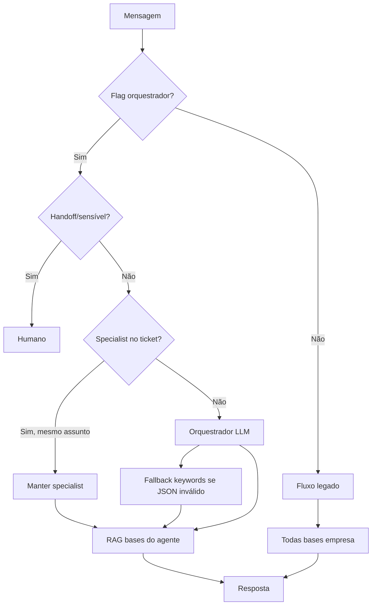

# Relatório Técnico — Fase 1: Orquestrador + Especialistas + RAG Isolado

**Data:** 2026-07-18  
**Ambiente:** Homologação / local  
**Status:** Implementado — feature flag **desligada por padrão**  
**Produção:** Não deployado · **main:** não pushado

---

## 1. Arquitetura implementada

### Fluxo novo (quando feature flag ativa)

```
Mensagem WhatsApp
  → Handoff/sensível? → humano
  → resolveSpecialistAgent()
      → Ticket já tem specialist + mesmo assunto? → mantém
      → Senão → AiOrchestratorService (LLM + fallback determinístico)
  → getKnowledgeBaseIdsForAgent() — SOMENTE AiAgentKnowledgeBases (+ queueLinks)
  → RAG pgvector
  → LLM do especialista
  → Resposta + AiRoutingLog
```

### Fluxo legado (preservado)

Quando `AI_ORCHESTRATOR_ENABLED=false` **ou** setting `aiOrchestratorEnabled` ≠ `enabled`:

```
Mensagem → getActiveAgent(fila) → getKnowledgeBaseIdsForAgent (fallback todas as bases) → resposta
```

---

## 2. Feature flag

| Camada | Chave | Default |
|--------|-------|---------|
| Global | `AI_ORCHESTRATOR_ENABLED` | `false` |
| Por empresa | Setting `aiOrchestratorEnabled` | `disabled` |

**Ativo somente quando:** global `true` **e** empresa `enabled`.

Configuração do orquestrador (env):

- `AI_ORCHESTRATOR_MODEL`
- `AI_ORCHESTRATOR_TEMPERATURE`
- `AI_ORCHESTRATOR_MAX_TOKENS`
- `AI_ORCHESTRATOR_TIMEOUT_MS`
- `AI_ORCHESTRATOR_CONFIDENCE_THRESHOLD`
- `AI_ORCHESTRATOR_PROVIDER`

---

## 3. Banco de dados

### Migration (reversível)

`backend/src/database/migrations/20260718100000-ai-phase1-orchestrator.ts`

**AiAgents — novos campos:**
- `role` (`legacy` | `orchestrator` | `specialist`) — default `legacy`
- `specialty`, `routingDescription`, `routingKeywords` (JSONB), `priority`

**Novas tabelas:**
- `AiAgentKnowledgeBases` — agente ↔ base (unique por company/agent/base)
- `AiRoutingLogs` — auditoria de roteamento

**Índice único parcial:** 1 orquestrador ativo por `companyId`.

---

## 4. Arquivos criados

| Arquivo |
|---------|
| `backend/src/database/migrations/20260718100000-ai-phase1-orchestrator.ts` |
| `backend/src/models/AiAgentKnowledgeBase.ts` |
| `backend/src/models/AiRoutingLog.ts` |
| `backend/src/services/AiServices/AiOrchestratorConfig.ts` |
| `backend/src/services/AiServices/AiOrchestratorFeatureFlag.ts` |
| `backend/src/services/AiServices/AiOrchestratorService.ts` |
| `backend/src/services/AiServices/AiAgentKnowledgeBaseService.ts` |
| `backend/src/controllers/AiOrchestratorController.ts` |
| `backend/src/scripts/seedAiPhase1Orchestrator.ts` |
| `backend/src/services/AiServices/__tests__/AiOrchestratorRouting.spec.ts` |
| `docs/AI_PHASE1_REPORT.md` |

---

## 5. Arquivos alterados

| Arquivo | Alteração |
|---------|-----------|
| `backend/src/models/AiAgent.ts` | Campos role/specialty/routing + relação KB |
| `backend/src/database/index.ts` | Registro dos novos models |
| `backend/src/services/AiServices/AiHelpers.ts` | RAG isolado, resolveSpecialistAgent, continuidade |
| `backend/src/services/AiServices/ProcessInboundMessageService.ts` | Integração orquestrador |
| `backend/src/controllers/AiAgentController.ts` | CRUD role/KB + status |
| `backend/src/controllers/KnowledgeBaseController.ts` | linkedAgents |
| `backend/src/routes/aiRoutes.ts` | Rotas preview + status |
| `backend/src/services/AiServices/AiPlaygroundService.ts` | RAG mode-aware |
| `backend/package.json` | `seed:ai-phase1` |
| `frontend/src/pages/AiAgents/index.js` | UI role/specialty/KB |
| `frontend/src/pages/AiKnowledgeBases/index.js` | Coluna agentes |
| `frontend/src/pages/AiPlayground/index.js` | Preview roteamento |
| `scripts/dev-local.sh` | Env vars orquestrador |

---

## 6. API nova

| Método | Rota | Função |
|--------|------|--------|
| GET | `/ai/orchestrator/status` | Status flag + config |
| POST | `/ai/orchestrator/preview` | Testar roteamento |

**Agentes:** `POST/PUT /ai/agents` aceita `role`, `specialty`, `routingDescription`, `routingKeywords`, `knowledgeBaseIds`, `priority`.

---

## 7. Seed (parametrizável, idempotente)

```bash
cd backend
COMPANY_ID=<id> npm run seed:ai-phase1
```

- **Não** assume `companyId=1`
- **Não** cria bases/documentos fictícios
- Vincula bases existentes por hints no nome (faq, financeiro, suporte, geral)

---

## 8. Testes executados

```bash
npx jest src/services/AiServices/__tests__/AiOrchestratorRouting.spec.ts
```

| Resultado | Detalhe |
|-----------|---------|
| **42 testes** | **42 passed** |
| Cenários | Financeiro (5), Suporte (5), FAQ (3), Geral (4), ambíguos, sanitização, topic shift, extended (20) |
| Build | `npm run build` ✅ |
| Migration | `npm run db:migrate` ✅ |

---

## 9. Como ativar em homologação

```bash
# 1. Migration (se ainda não rodou)
cd backend && npm run build && npm run db:migrate

# 2. Seed estrutura (opcional)
COMPANY_ID=1 npm run seed:ai-phase1

# 3. backend/.env
AI_ORCHESTRATOR_ENABLED=true

# 4. Setting no painel ou SQL
# aiOrchestratorEnabled = enabled  (companyId da empresa)

# 5. Reiniciar backend
# 6. /ai/agents — vincular bases aos especialistas
# 7. /ai/playground — Testar roteamento
```

---

## 10. Diagrama



---

## 11. Riscos identificados

| Risco | Mitigação |
|-------|-----------|
| LLM roteia errado | Fallback keywords + Atendimento Geral |
| Custo extra (2 LLM) | Orquestrador mini, continuidade no ticket |
| Empresa sem bases linkadas | RAG vazio → handoff existente |
| Migration em prod | Rodar manualmente no Supabase antes de flag |

---

## 12. Pendências — Fase 2

- CMS documental (rascunho → publicado)
- Versionamento e rollback de docs
- Reindex assíncrono (Bull)
- Categorias/pastas por domínio
- Memória persistente por contato
- Tool calling

---

## 13. Confirmação de compatibilidade

- Agentes existentes recebem `role=legacy` na migration
- Com flag desligada, comportamento **idêntico** ao anterior
- Nenhuma empresa migrada automaticamente
- Copilot, aprendizados, handoff e playground legado preservados
- Implementação incremental e reversível via env + setting

**Pronto para evoluir para Fase 2 sem refatoração estrutural.**
