# Manual Oficial da Plataforma Ticketz

**Versão:** 1.5.99 — auditada contra o código
**Data:** agosto/2026  
**Status:** documentação oficial — mantida por rule permanente  
**Repositório:** `ticketz/` (backend + frontend independentes)  
**Regra de manutenção:** `.cursor/rules/documentation-rules.mdc` + `docs/.documentation-rules.md`  
**Histórico:** `docs/changelog.md`

### Estrutura da documentação

```
docs/
├── MANUAL_PLATAFORMA.md      ← fonte de verdade (este arquivo)
├── .documentation-rules.md   ← regras obrigatórias de atualização
├── architecture.md           ← índice
├── ai.md                     ← índice
├── rag.md                    ← índice
├── database.md               ← índice
├── api.md                    ← índice
├── deployment.md             ← índice
├── frontend.md               ← índice
├── backend.md                ← índice
├── integrations.md           ← índice
├── roadmap.md                ← índice
└── changelog.md              ← histórico
```

Toda alteração estrutural no código **deve** atualizar este manual antes de concluir a tarefa.

---

## Sumário

### Parte I — Visão geral (seções 1–24, auditadas)
1. [O que é o Ticketz](#1-o-que-é-o-ticketz)
2. [Visão geral da arquitetura](#2-visão-geral-da-arquitetura)
3. [Conceitos fundamentais](#3-conceitos-fundamentais)
4. [Perfis de usuário e permissões](#4-perfis-de-usuário-e-permissões)
5. [Menu e módulos do painel](#5-menu-e-módulos-do-painel)
6. [Como a plataforma atende (fluxos operacionais)](#6-como-a-plataforma-atende-fluxos-operacionais)
7. [Módulo WhatsApp e conexões](#7-módulo-whatsapp-e-conexões)
8. [Tickets e atendimento humano](#8-tickets-e-atendimento-humano)
9. [Filas e chatbot](#9-filas-e-chatbot)
10. [Contatos, tags e agendamentos](#10-contatos-tags-e-agendamentos)
11. [Módulo de Inteligência Artificial](#11-módulo-de-inteligência-artificial)
12. [Campanhas em massa](#12-campanhas-em-massa)
13. [Chat interno, dashboard e relatórios](#13-chat-interno-dashboard-e-relatórios)
14. [Financeiro, planos e SaaS](#14-financeiro-planos-e-saas)
15. [API externa e integrações](#15-api-externa-e-integrações)
16. [Tempo real (WebSocket)](#16-tempo-real-websocket)
17. [Filas de processamento (Bull/Redis)](#17-filas-de-processamento-bullredis)
18. [Armazenamento de mídia](#18-armazenamento-de-mídia)
19. [Internacionalização (i18n)](#19-internacionalização-i18n)
20. [Opções de deploy e ambientes](#20-opções-de-deploy-e-ambientes)
21. [Desenvolvimento local](#21-desenvolvimento-local)
22. [O que está pronto vs. em evolução](#22-o-que-está-pronto-vs-em-evolução)
23. [Referência técnica rápida](#23-referência-técnica-rápida)
24. [Licença e compliance](#24-licença-e-compliance)

### Parte II — Referência técnica aprofundada
25. [Diagrama de arquitetura](#25-diagrama-de-arquitetura)
26. [Fluxo WhatsApp (mensagens)](#26-fluxo-whatsapp-mensagens)
27. [Fluxo IA (inbound)](#27-fluxo-ia-inbound)
28. [Fluxo RAG](#28-fluxo-rag)
29. [Fluxo upload e indexação de documentos](#29-fluxo-upload-e-indexação-de-documentos)
30. [Fluxo handoff IA → humano](#30-fluxo-handoff-ia--humano)
31. [Fluxo Copilot](#31-fluxo-copilot)
32. [Fluxo Playground](#32-fluxo-playground)
33. [Banco de dados — módulo IA](#33-banco-de-dados--módulo-ia)
34. [Relação entre tabelas IA](#34-relação-entre-tabelas-ia)
35. [Estrutura de pastas — backend](#35-estrutura-de-pastas--backend)
36. [Estrutura de pastas — frontend](#36-estrutura-de-pastas--frontend)
37. [Serviços principais e responsabilidades](#37-serviços-principais-e-responsabilidades)
38. [Variáveis de ambiente — IA e storage](#38-variáveis-de-ambiente--ia-e-storage)
39. [Dependências externas](#39-dependências-externas)
40. [Pontos de extensão existentes](#40-pontos-de-extensão-existentes)
41. [Dívidas técnicas](#41-dívidas-técnicas)
42. [Gargalos de desempenho](#42-gargalos-de-desempenho)
43. [Riscos arquitetônicos](#43-riscos-arquitetônicos)
44. [Melhorias recomendadas antes da Fase 2](#44-melhorias-recomendadas-antes-da-fase-2)

### Parte III — Auditoria
45. [Relatório de auditoria](#45-relatório-de-auditoria)

---

## Convenção de auditoria

Cada seção da Parte I inclui bloco **Auditoria** com:
- **Existe no código:** sim / parcial / não
- **Arquivos principais**
- **Serviços / controllers / models / rotas / tabelas**
- **Dependências**
- **Limitações conhecidas**
- **Divergências corrigidas** (quando aplicável)

---

## 1. O que é o Ticketz

O **Ticketz** é plataforma de comunicação via **WhatsApp** com CRM e helpdesk. Cada **Company** (tenant) opera isolada com usuários, conexões, filas, contatos e tickets.

### Auditoria §1

| Item | Valor verificado |
|------|------------------|
| **Existe** | Sim — README.pt.md, modelos multitenancy |
| **Models** | `Company`, `User`, `Ticket`, `Contact`, `Whatsapp`, `Queue` |
| **Limitações** | WhatsApp via biblioteca não oficial (Baileys/libzapitu-rf) |
| **Divergências** | Nenhuma |

---

## 2. Visão geral da arquitetura

### Stack (verificado em `backend/package.json`, `frontend/package.json`)

| Camada | Tecnologia | Entrada / observação |
|--------|------------|----------------------|
| Backend | Node.js, Express, TypeScript | `backend/src/server.ts` |
| ORM | Sequelize + PostgreSQL | `backend/src/database/migrations/` |
| Filas | Redis + Bull | `backend/src/queues.ts` |
| WhatsApp | **libzapitu-rf** `^1.0.0-alpha.16` | `backend/src/libs/wbot.ts` |
| Frontend | React 17, MUI v4, CRA 5 | `frontend/src/App.js` |
| Tempo real | Socket.io | `backend/src/libs/socket.ts` |
| IA | OpenAI-compatible + pgvector | `backend/src/services/AiServices/` |
| Storage | Local ou S3-compat (B2/R2/MinIO) | `backend/src/services/StorageService/` |

### Startup "fast shell" (`server.ts`, `appFast.ts`)

```
server.ts → http.createServer(appFast)
  → ensureCoreRoutes()     auth + settings
  → initIO(server)         Socket.io
  → heavyRoutes.ts         rotas de negócio (async)
  → i18nReady → bootstrapAiPlatform → startQueueProcess
  → StartAllWhatsAppsSessions (se WHATSAPP_AUTO_START ≠ false)
```

| Variável | Comportamento verificado |
|----------|-------------------------|
| `WHATSAPP_AUTO_START=false` | Pula start de sessões (`server.ts:19`) |
| `WHATSAPP_DEFER_START_MS` | Adia WhatsApp N ms (`server.ts:68–77`) |
| `AUTO_MIGRATE=true` | Aplica migrations na subida (`MigrationService.ts:137`) |
| `PORT` | Padrão **8080** se ausente (`server.ts:12`) |

### Auditoria §2

| Item | Valor |
|------|-------|
| **Arquivos** | `server.ts`, `appFast.ts`, `routes/heavyRoutes.ts`, `bootstrap.ts` |
| **Rotas fast shell** | `/health`, `/version`, `/public/*`, `/public-settings/*`, `POST /auth/login` |
| **Limitações** | Heavy routes carregam async; `/health` expõe `heavyRoutes` via `routeReadiness` |
| **Divergências corrigidas** | Versão exata da lib WhatsApp: `libzapitu-rf ^1.0.0-alpha.16` |

---

## 3. Conceitos fundamentais

### Company (`backend/src/models/Company.ts`)
Tenant: usuários, WhatsApps, filas, tickets, `planId`, `dueDate`, idioma, status.

### Whatsapp (`backend/src/models/Whatsapp.ts`)
Conexão WhatsApp: status, mensagens automáticas, token API, filas via `WhatsappQueue`.

### Queue (`backend/src/models/Queue.ts`)
Fila de atendimento + chatbot (`QueueOption`) + SLA (`slaSeconds`, `slaSupervisorEscalationSeconds`).

### Ticket (`backend/src/models/Ticket.ts`)
| Campo | Valores |
|-------|---------|
| `status` | `pending`, `open`, `closed` |
| `userId` | Atendente (null = não assumido) |
| `chatbot` | Boolean — cliente no menu de opções |
| Campos `ai*` | 21 campos — ver [§33](#33-banco-de-dados--módulo-ia) |

### Contact, Message
`Contact`: número, tags, `disableBot`, idioma.  
`Message`: id string WhatsApp, ack, mídia, reações, edição.

### Auditoria §3

| Item | Valor |
|------|-------|
| **Tabelas** | `Companies`, `Whatsapps`, `Queues`, `QueueOptions`, `Tickets`, `Contacts`, `Messages`, `WhatsappQueues`, `UserQueues` |
| **Dependências** | Ticket → Contact, User, Queue, Whatsapp, Company |
| **Limitações** | `Ticket.aiAgentId` sem associação Sequelize `@BelongsTo AiAgent` no model |

---

## 4. Perfis de usuário e permissões

### Níveis (`User.profile`, `User.super`)

| Perfil | Campo | Escopo |
|--------|-------|--------|
| Atendente | `profile: "user"` | Filas em `UserQueues` |
| Admin | `profile: "admin"` | Gestão da empresa |
| Super | `super: true` | Cross-tenant |

### Autenticação
- JWT Bearer + cookie `jrt` (refresh)
- `tokenVersion` invalida sessões
- Turnstile opcional (`TURNSTILE_ENABLED` + keys em env ou Settings)

### Middlewares (`backend/src/middleware/`)

| Middleware | Comportamento |
|------------|---------------|
| `isAuth` | JWT; 401 `ERR_UNAUTHORIZED`, 403 `ERR_SESSION_EXPIRED` |
| `isAdmin` | 403 se `profile !== "admin"` |
| `isSuper` | 401 se `!super` |
| `isCompliant` | 401 sem `companyId`; **402** `ERR_SUBSCRIPTION_EXPIRED` |
| `requireAiPlatformReady` | **503** `ERR_AI_MIGRATIONS_PENDING` |
| `tokenAuth` | Bearer = token da conexão WhatsApp |
| `apiTokenAuth` | Bearer = Setting `apiToken` → impersona admin |

### Frontend (`frontend/src/rules.js`)
Permissões **admin.static** (9 itens): `drawer-admin-items:view`, `tickets-manager:showall`, conexões, etc.  
**user.static:** `[]` (vazio).

### Auditoria §4

| Item | Valor |
|------|-------|
| **Controllers auth** | `SessionController.ts` — login, refresh, impersonate |
| **Rotas** | `routes/authRoutes.ts` |
| **Compliance** | `helpers/CheckCompanyCompliant.ts` — company 1 sempre compliant; grace period de Setting |
| **Divergências corrigidas** | `isCompliant` retorna **402**, não genérico "bloqueia operação" |

---

## 5. Menu e módulos do painel

### Lógica de visibilidade (`frontend/src/layout/MainListItems.js`)

- **Atendimento** (tickets, contatos, etc.): `<Can perform="drawer-service-items:view" no={() => ...} />` — permissão **não existe** em `rules.js`, logo `no()` **sempre renderiza** → visível a **todos** os autenticados.
- **Administração**: `<Can perform="drawer-admin-items:view" yes={() => ...} />` → só **admin**.
- **Avisos**: admin + `user.super`.
- **Campanhas**: `localStorage.getItem("cshow")` truthy.

### Rotas (`frontend/src/routes/index.js`)

| Rota | Página | Admin |
|------|--------|-------|
| `/tickets` | TicketResponsiveContainer | Não |
| `/connections` | Connections | Sim |
| `/queues` | Queues | Sim |
| `/ai/*` | 9 páginas IA | Sim |
| `/` | Dashboard | Sim |
| `/subscription` | Subscription | Sim (rota privada, menu não explícito) |

### Auditoria §5

| Item | Valor |
|------|-------|
| **Divergências corrigidas** | Dashboard **não** visível a atendentes; só admin. Seção "Atendimento" visível a todos. |

---

## 6. Como a plataforma atende (fluxos operacionais)

Ordem real em `wbotMessageListener.ts` → `handleMessage` (linhas ~1655–2184):

1. Validar mensagem → contato → ticket (`FindOrCreateTicketService`)
2. Persistir mensagem (`verifyMessage` / `verifyMediaMessage`)
3. **Retorno antecipado** se grupo, `disableBot` ou `fromMe`
4. **`tryEngageAiOnInboundMessage`** — se true, **return** (IA tem prioridade; em conexão multifila escolhe silenciosamente uma fila com agente da marca)
5. Horário / outOfHours + possível segundo engage IA
6. **`verifyQueue`** — menu numérico permanece apenas para conexões sem agente IA elegível
7. Saudação debounced
8. **`handleChartbot`** — opções numéricas

### Auditoria §6

| Item | Valor |
|------|-------|
| **Serviços** | `FindOrCreateTicketService`, `CreateMessageService`, `AiReengagementService`, `UpdateTicketService` |
| **Divergências corrigidas** | IA é tentada **antes** do chatbot, não depois. ProcessInboundMessage **não** é chamado diretamente no listener — passa por `AiInboundQueue`. |

---

## 7. Módulo WhatsApp e conexões

### Implementado
- CRUD: `WhatsappController`, `routes/whatsappRoutes.ts`
- Sessão: `WhatsAppSessionController`, `routes/whatsappSessionRoutes.ts`
- Listener: `WbotServices/wbotMessageListener.ts`
- Socket sessão: `libs/wbot.ts` emite `company-{id}-whatsappSession` e global `whatsappSession`
- Watchdog memória: `WhatsAppSessionWatchdogService` (15s pós-startup) + fila `WhatsappWatchdog` cron `*/5 * * * *`
- Reconexão: conflito **440** preserva `BaileysKeys`; rotações automáticas de QR (428) não apagam credenciais; estado **PAIRING** durante scan

### Guarda de abertura de sessão (`StartWhatsAppSession.ts`)

`openingSessions` (`Map<whatsappId, Promise>`) impede dois `initWASocket` simultâneos na mesma conexão. Quem consulta a guarda:

| Consumidor | Comportamento quando a guarda está ativa |
|------------|------------------------------------------|
| `WhatsAppSessionWatchdogService` | `isWhatsAppSessionStarting()` → pula a conexão |
| `scheduleSessionRestart` (`libs/wbot.ts`) | pula o restart agendado |
| `StartWhatsAppSession` | devolve a promise em curso (botão *reconectar* do painel vira no-op) |

**A guarda é liberada pelo start limitado por `withTimeout` (`WHATSAPP_START_TIMEOUT_MS`, padrão 90s), nunca por `initWASocket`.** O Baileys pode deixar essa promise pendente para sempre; amarrar a liberação a ela mantinha `isWhatsAppSessionStarting()` verdadeiro indefinidamente e as três vias de recuperação acima ficavam bloqueadas — a conexão permanecia `DISCONNECTED` até reinício do processo, sem nenhuma mensagem inbound chegando ao Ticketz.

Cobertura: `services/WbotServices/__tests__/StartWhatsAppSessionGuard.spec.ts`.

### Reset de credenciais — sempre limpar `BaileysKeys` junto

`Whatsapps.session` guarda as **creds**; `BaileysKeys` guarda as **chaves de sinal** da mesma identidade. As duas formam um par: zerar só uma delas produz um estado híbrido em que `authState()` monta creds novas (`initAuthCreds()`) sobre as chaves da identidade anterior.

Todo caminho que inicia um pareamento novo limpa os dois:

| Caminho | Rota |
|---------|------|
| Novo QR | `PUT /whatsappsession/:id` |
| Reset de sessão | `POST /whatsappsession/:id/reset` |
| Desconectar | `DELETE /whatsappsession/:id` |
| Falha de importação de dump | `WhatsAppSessionController.capture` |
- Wavoip: `WavoipController`, model `Wavoip`
- Capture token: `BuildCaptureExtensionService`, `buildCaptureExtensionRoutes`

### Status da conexão (usados no frontend `MainListItems.js`)
`CONNECTED`, `DISCONNECTED`, `qrcode`, `PAIRING`, `OPENING`, `TIMEOUT`

### Auditoria §7

| Tabelas | `Whatsapps`, `WhatsappQueues`, `BaileysKeys`, `BaileysContacts`, `WhatsappLidMaps` |
|---------|-----|
| **Limitações** | Sessão não oficial; risco de banimento WhatsApp |

---

## 8. Tickets e atendimento humano

### Rotas (`routes/ticketRoutes.ts`)
CRUD + **`POST /tickets/:ticketId/reopen`** (reabertura manual de ticket fechado; fecha ticket conflitante do mesmo contato com `justClose`) + ações IA em `/tickets/:id/ai/*` (assume, pause, resume, copilot, learning, explainability) + Repositório em `/tickets/:id/repository`.

### Reabertura manual
- **`POST /tickets/:ticketId/reopen`** — body opcional `{ releaseToAi: boolean }`
- Serviço: `ReopenClosedTicketManuallyService.ts`
- Resolve `ERR_OTHER_OPEN_TICKET` (400) fechando o outro ticket aberto/pending do mesmo contato antes de reabrir
- `releaseToAi: true` reabre em `pending` sem `userId`, reengajando IA quando permitido

### UI da conversa (compacta)
- Cabeçalho `TicketInfo`: mostra **telefone · nome · Ticket #ID**, com o telefone em primeiro lugar
- Lightbox: imagens são buscadas por `/media/message/:messageId/stream` e abertas por `blob:`; URLs `blob:` e `data:` não recebem cache-buster
- Envio de texto é otimista e não bloqueante: `MessageInputCustom` limpa e refoca o campo imediatamente, adiciona uma mensagem temporária na conversa e deixa o `POST /messages/:ticketId` rodar em segundo plano; `TicketsContext` confirma/substitui ou remove a mensagem temporária sem impedir a próxima digitação
- Barra de ticket fechado: apenas ícones (Reabrir / Reabrir e chamar IA)
- `TicketConversationToolbar`: ícones para Repositório, Tags (colapsável), Painel administrativo e estado IA
- Diagnóstico IA (timeline, explicabilidade, copiloto) concentrados no drawer `TicketAdminPanel`, não no topo da conversa
- **Supervisão / observação:** `MessagesList` com `markAsRead={false}` carrega automaticamente todas as páginas de histórico e exibe botão **Carregar mensagens anteriores** quando houver mais registros; polling **1s** no chat + indicador **IA digitando…** quando `aiProcessingState=processing`; barra com **Participar**, **Solicitar conserto** (e-mail técnico via Resend), **Ensinar IA** e dialog para anexar à base **Respostas anexas** (`POST /tickets/:id/ai/annex-response`). Abrir o dialog não grava conhecimento: a base da marca só é criada no primeiro **Anexar à base**, quando também é vinculada automaticamente aos agentes ativos cuja persona pertence à mesma marca
- **Lista IA:** ao assumir ticket (`userId` preenchido), o socket remove o item da aba **IA** imediatamente (`TicketsListCustom`)

### Controllers
`TicketController.ts`, `TicketAiController.ts`, `AiLearningController.ts`

### Serviços
`TicketServices/*`, `MessageServices/CreateMessageService.ts`, `UpdateTicketService.ts`

### Tela
`TicketResponsiveContainer`, `TicketsListCustom`, `MessagesList`, `MessageInputCustom`

### Zerar base de clientes (somente super admin)
- Botão no topo da lista de tickets (`TicketsManagerTabs`), **antes** das abas Abertas/Resolvidos
- Visível para **master admin** (`isMasterAdminUser`: `super`, `profile=admin` ou email em `MASTER_ADMIN_EMAILS`)
- Endpoint: `POST /ai/wipe-customer-base` (`AiResetController.wipeCustomerBase`)
- Serviço: `ResetTestEnvironmentService.resetTestEnvironmentForCompany(companyId, { wipeContacts: true })` — transação Sequelize com **deletes SQL sequenciais** e subqueries por `companyId`; tabelas IA opcionais ausentes no schema usam `SAVEPOINT` (Postgres aborta transação em 42P01 se não houver rollback); inclui `quotedMsgId`, `TicketNotes`, `OutOfTicketMessages`; remove dependências antes de apagar `Tickets` e `Contacts`; erros não-`AppError` viram `ERR_WIPE_CUSTOMER_BASE_FAILED` com log Postgres (`constraint`, `detail`)
- **Admin master:** email `fernandofortmax@gmail.com` (env `MASTER_ADMIN_EMAILS`) + `profile=admin` ou `super=true`
- Apaga tickets, mensagens, logs IA e **todos os contatos** da empresa — próximo WhatsApp entra como cliente novo
- **Um clique:** sem confirmação modal; limpa a UI via socket `wipe` + redirect `/tickets`

### IA multi-marca (Fortmax vs Nível Cashback)
- Cadeia obrigatória: **WhatsApp** → **fila** (`WhatsappQueues`) → **agente** (`AiAgentQueues`) → **bases** (`AiAgentKnowledgeBases`) → **domínio CMS** (`KnowledgeDomain`)
- Serviço idempotente: `WireSupportLinesService.wireSupportLinesForCompany(companyId)` — liga Web G3↔filas Fortmax↔agente Fortmax e WhatsApp Nível↔filas Consumidor/Empresa/Recuperação↔Nivelton; cada fila Nível recebe a base correspondente e o agente acumula somente bases do domínio Nível Cashback. **Fortmax e Nível são ligados de forma independente**; filas departamentais já ligadas à conexão são preservadas e vínculos cruzados de agentes são removidos. O wiring não cria, altera nem exclui bases de respostas supervisionadas; **Respostas anexas — Nível** (`respostas-anexas-nivel`) ou **Respostas anexas — Fortmax** (`respostas-anexas-fortmax`) só é criada quando o primeiro ensinamento da marca é confirmado, caso ainda não exista
- Auditoria: `AuditSupportLinesService.auditSupportLinesForCompany(companyId)` — valida todas as filas ligadas à conexão, exige exatamente um agente compatível por fila, rejeita vínculo cruzado Nível×Fortmax e contabiliza fontes prontas tanto no legado quanto no CMS publicado; ambas as marcas aceitam múltiplas filas próprias; `GET /ai/audit-support-lines` (master); `npm run audit:support-lines`
- `POST /ai/wire-support-lines` executa wire + auditoria + reengajamento de tickets presos
- Executado no **startup** (`bootstrapAiPlatform`, aguarda wiring antes do first-responder; env `WIRE_SUPPORT_LINES=0` desliga) e via **`POST /ai/wire-support-lines`** (admin)
- **Schema IA/triage:** `ApplyAiSchemaService.applyAiSchema()` (script `apply-db-schema.js`) garante tabelas IA, `AiCopilotSuggestions` e colunas triage v2 (`aiCorrelationId`, `aiProcessingState`, `aiAssist*`, `AiTicketTimelineEvents`); validado em `verify-runtime-ready.js` e `validate-triage-v2-schema.js` no deploy VPS
- Agentes legacy/specialist mantêm `maxTokens=4096` após wiring (evita OOM na completion)
- Após wiring/restart: `ReengageStuckAiTicketsService` reprocessa tickets abertos/pendentes sem `aiAgentId` mas com agente na fila (última mensagem do cliente)
- Manual ops: `COMPANY_ID=1 npm run wire:support-lines`
- `EnsureAiFirstResponderService` **não** liga Webin automaticamente em nenhuma fila cujo nome identifique Nível, Fortmax ou WebG3; os vínculos dessas marcas são administrados explicitamente
- `resolveQueueIdForTicket`: conexões com várias filas IA não exibem menu. O roteamento técnico escolhe silenciosamente uma fila com agente ativo (Consumidor na Nível; Suporte na Fortmax), desliga `ticket.chatbot` e preserva todas as bases vinculadas ao agente/domínio para a resposta. Com IA ativa, `startQueue` não envia `Queue.greetingMessage` legado (ex.: “Você foi direcionado…”), alinhado ao bypass de fora do expediente
- Identidade, saudação, fallback informativo e regras operacionais são resolvidos por `AgentPersonaService` a partir do agente ativo (Nivelton ≠ Webin); texto do cliente nunca determina a marca. Na Nível, recuperação segue os links oficiais da base e casos sem procedimento seguro apontam para `https://nivelvelo.com/chamado`. Na Fortmax, ausência de procedimento usa Thiago (suporte) ou Cristiane (gerência/financeiro), sem inventar portal

### Filtro por linha WhatsApp (lista de tickets)
- Barra de chips abaixo das abas Abertas/Resolvidos: **Todos**, **Web G3**, **Nível**, etc. (nome da conexão em Administração → Conexões)
- Backend: `whatsappIds` em `GET /tickets` filtra tickets pela conexão que recebeu a mensagem
- Combinável com filtro de filas existente

### Auditoria §8

| Tabelas | `Tickets`, `Messages`, `TicketNotes`, `TicketTags`, `TicketTrakings` |
|---------|-----|
| **Middleware** | `isCompliant` em rotas de ticket e mensagem |
| **Socket** | `company-{id}-ticket`, `company-{id}-appMessage` |

---

## 9. Filas e chatbot

### Rotas
`routes/queueRoutes.ts`, `routes/queueOptionRoutes.ts`

### Serviços
`QueueService/*`, `QueueOptionService/*`

### Chatbot
- `verifyQueue` — seleção por número somente no fluxo legado, quando não há agente IA elegível
- `handleChartbot` — árvore `QueueOption` (`parentId`, `forwardQueueId`, `exitChatbot`)
- `startQueue` define `chatbot: queue.options.length > 0`

### Roteamento IA sem menu

Com uma ou várias filas, IA habilitada e agente ativo, `resolveQueueIdForTicket` escolhe uma fila operacional sem pedir `1`, `2` ou `3` ao cliente. A escolha serve apenas para o ticket entrar no fluxo; a IA continua consultando todas as bases ativas vinculadas ao agente e todas as bases irmãs do mesmo domínio.

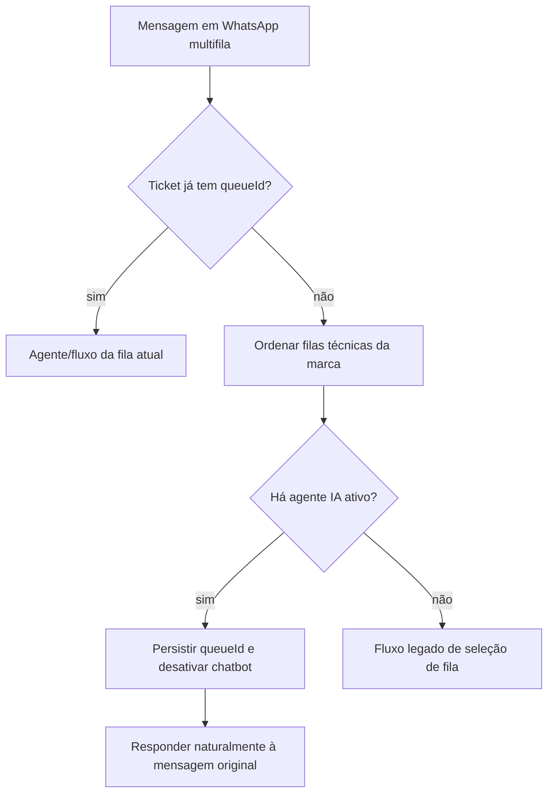

`syncExclusiveAgentQueueLinks` remove vínculos antigos ao trocar ou limpar a fila de atendimento do agente. A tela envia `queueLinks: []` quando “Nenhuma” é selecionada, evitando vínculos ocultos.

Na conexão Nível, as filas **Suporte Consumidor**, **Suporte Empresa** e **Recuperar Conta** permanecem associadas às bases específicas, mas a fila técnica padrão é **Suporte Consumidor**. Na Fortmax, a fila técnica padrão é **Suporte**. Como o agente também recupera as bases do domínio da própria marca, uma pergunta de empresa, recuperação ou financeiro não fica limitada à fila técnica escolhida.

### Auditoria §9

| Tabelas | `Queues`, `QueueOptions`, `UserQueues`, `WhatsappQueues`, `AiAgentQueues` |
|---------|-----|

---

## 10. Contatos, tags e agendamentos

### Contatos
`ContactController`, `ContactServices/*`, rotas `contactRoutes.ts` (+ `apiTokenAuth` opcional)

### Tags
`TagController`, `TagServices/*`, `TicketTag`, `ContactTag`

### Agendamentos
`ScheduleController`, filas `ScheduleMonitor` (cron **a cada 5 segundos**: `*/5 * * * * *`) + `SendSacheduledMessages`

### Auditoria §10

| Tabelas | `Contacts`, `ContactCustomFields`, `ContactTags`, `Tags`, `Schedules` |
|---------|-----|

---

## 11. Módulo de Inteligência Artificial

> Detalhes técnicos: [§26–§34](#26-fluxo-whatsapp-mensagens). Config operacional: `docs/AI_SETUP.md`.

### Gate de funcionalidade
IA só opera quando `AiPlatformState.aiFeaturesEnabled === true` (setado em `bootstrapAiPlatform` / `requireAiPlatformReady`). Depende de schema aplicado + diagnóstico.

### Capacidades verificadas no código

| Capacidade | Serviço principal | Status |
|------------|-------------------|--------|
| Resposta automática WhatsApp | `ProcessInboundMessageService` | ✅ |
| Fila assíncrona | `AiInboundQueueService` | ✅ |
| RAG pgvector | `RetrievalEngine`, `KnowledgeContextService` | ✅ |
| Handoff | `HandoffToHumanService` | ✅ |
| Copilot | `AiCopilotService` | ✅ |
| Playground | `AiPlaygroundService` | ✅ |
| Memória por contato | `ContactAiMemoryService` + fila Bull | ✅ (flag dupla, default OFF) |
| Ferramentas executáveis | `ToolRegistry`, `ToolLoopService`, 9 tools (4 read + 5 write) | ✅ (flags, write OFF default) |
| Observabilidade IA v2 | `AiMetricsAggregator`, snapshots, cache Redis | ✅ |
| Orquestrador | `AiOrchestratorService` | ✅ (flag dupla) |
| Transcrição áudio | `AudioInboundResolver` | ✅ |
| Visão/OCR imagem | `AiVisionOcrService` | ✅ |
| Diagnóstico | `AiDiagnosticsService` | ✅ |
| Aprendizado | `AiLearningService` | ✅ |
| Replay | `AiReplayService` | ✅ |
| Repositório multimodal | `ContentRepositoryService`, tools `search_repository` / `send_repository_item` | ✅ (v1.5) |
| ACK por agente | `AiInboundQueueService` + campos `ackEnabled` | ✅ |
| SLA handoff | `AiSlaMonitorService` | ✅ |
| Follow-up proativo | `AiProactiveFollowUpService` | ✅ |
| E-mail de conserto técnico | `EscalationEmailService`, `EscalationResolutionService` | ✅ (Resend + formulário público) |

Imagens recebidas no WhatsApp passam por `MediaInboundResolver` e pelo `visionModel` do agente. A análise visual roda já no ingest (`verifyMediaMessage` → `analyzeAndPersistInboundImageVision`), usando buffer local em data URL base64; o resumo fica em `MessageMediaFiles.visionSummary` e entra no turno como `[Imagem enviada pelo cliente]: …`. O turno IA preserva esse bloco mesmo quando a legenda é escolhida como texto principal (`InboundImageContext`). Com falha de leitura/análise, o turno ainda registra que houve imagem — a IA não deve dizer que “não vê imagens”.

Confirmações visuais de recuperação de conta são tratadas por `AccountRecoverySuccessReplyService`: quando a tela informa que a solicitação foi enviada e que a nova senha chegará por e-mail, a resposta tranquiliza o cliente, repete somente o prazo visível, orienta a verificar entrada/spam e proíbe abrir chamado duplicado. Envelopes de edição `secretEncryptedMessage` são processados como protocolo e não entram como novo turno da IA.

### Saudação e identidade do agente

| Situação | Resposta |
|----------|----------|
| Abertura, contato com pushName | `Olá, {PrimeiroNome}, {bom dia/boa tarde/boa noite}! Em que posso ajudar?` |
| Abertura, sem pushName utilizável | `Olá, {período}! Em que posso ajudar?` |
| Já cumprimentado no mesmo ticket | `Em que posso ajudar?` |
| Cliente pergunta o nome do assistente | `buildAgentIdentityReply` — extrai o trecho entre aspas do `basePrompt` |

A saudação é montada em `AgentPersonaService.buildAgentGreetingReply` + `buildTimeBasedGreeting`, **não** no prompt do agente. O nome do cliente vem de `resolveCustomerFirstName`, que descarta `Contact.name` quando ele é o próprio telefone (o Ticketz preenche esse campo com o número quando não há pushName).

### Pergunta de confirmação adiada

Resposta que manda o cliente executar um passo e **na mesma mensagem** cobra o resultado ("Conseguiu localizar sua conta?") pede resposta antes de existir o que responder. O recorte acontece em `deliverAiReply`, ponto único por onde passam todas as respostas da IA.

| Etapa | Onde |
|-------|------|
| Decisão do recorte (pura, sem I/O) | `AiDeferredQuestionRules.splitDeferrableConfirmation` |
| Agendamento (Redis) | `AiDeferredQuestionService.scheduleDeferredQuestion` |
| Entrega | cron `*/15 * * * * *` → `runDeferredQuestionSweep` |

**Só recorta quando todas valem:** a mensagem termina em `?`; a pergunta é uma frase única de até 120 caracteres; o corpo anterior tem ≥40 caracteres **e** um passo acionável (URL, "clique", "acesse", "insira"…); o corpo está no **contexto de recuperação de conta/senha**; a pergunta é de **confirmação de resultado** (`conseguiu`, `deu certo`, `funcionou`, `apareceu`, `recebeu`, `localizou`…) e **não** um pedido de dado (`qual`, `quando`, `onde`, `me informe`…).

Pedido de dado nunca é adiado — é ele que destrava o atendimento.

**A pergunta é descartada** se qualquer mensagem entrar no ticket depois da instrução (cliente respondeu, ou humano/IA continuou), ou se o ticket sair da elegibilidade da IA (`canAiEngageTicket`).

| Env | Padrão | Efeito |
|-----|--------|--------|
| `AI_DEFERRED_QUESTION_SECONDS` | `60` | Atraso da pergunta |
| `AI_DEFERRED_QUESTION_ENABLED` | ligado | `false` desliga o recorte |

Ampliar `RECOVERY_CONTEXT` muda a entrega de toda resposta da IA — é decisão de produto. Cobertura: `AiDeferredQuestion.spec.ts`.

### `basePrompt` é propriedade do painel

`WireSupportLinesService` roda a cada boot e religa filas, bases e agentes. Ele **não** sobrescreve o `basePrompt` editado no painel: `resolveSeededBasePrompt` só regrava a semente quando o prompt está vazio ou contém marcadores da outra marca. Alterar esse comportamento faz toda customização do admin ser perdida no restart seguinte.

### Orquestrador — condição real
Requer **ambos**:
1. `AI_ORCHESTRATOR_ENABLED` truthy no env (`AiOrchestratorConfig.ts`)
2. Setting `aiOrchestratorEnabled === "enabled"` na empresa (`AiOrchestratorFeatureFlag.ts`)

### Rotas IA (`routes/aiRoutes.ts`)
- Todas: `isAuth` + `isAdmin`
- Leitura (health, diagnostics, listagens): sem `requireAiPlatformReady`
- Escrita (POST/PUT/DELETE após linha 59): + `requireAiPlatformReady`

### Fase 3 — memória e tools (jul/2026)

**Feature flags (default OFF):**

| Recurso | Env global | Setting empresa |
|---------|------------|-----------------|
| Memória contato | `AI_CONTACT_MEMORY_ENABLED` | `aiContactMemoryEnabled` |
| Tools | `AI_TOOLS_ENABLED` | `aiToolsEnabled` |

**Endpoints novos:** `/ai/memory/status`, `/ai/tools/status`, `/ai/tools`, `/ai/agents/:agentId/tools`, `/ai/contacts/:contactId/memory` (+ export/CRUD), `/ai/tool-executions`, `/ai/wipe-customer-base` (super).

**Persistência de tools:** `PUT /ai/agents/:agentId/tools` **sempre grava** os bindings (`AiAgentTools`), mesmo com flags OFF. As flags controlam só a **execução** no WhatsApp. Resposta inclui `runtimeEnabled` + `warning: ERR_AI_TOOLS_DISABLED_RUNTIME` quando o runtime está desligado.

**Fila Bull:** `AiContactMemoryQueue` — job `persist-contact-memory` (sem `setImmediate`).

**Tools piloto:** `get_ticket_status`, `get_business_hours`, `search_published_knowledge`, `request_human_handoff` (handoff idempotente via Redis lock).

Spec: `docs/AI_PHASE3_ARCHITECTURE.md` · Relatório: `docs/AI_PHASE3_REPORT.md`

### Fase 4 — write tools + observabilidade (jul/2026)

**Flags write (default OFF):** `AI_WRITE_TOOLS_ENABLED` + Setting `aiWriteToolsEnabled` (requer tools ON).

**Write tools:** `add_ticket_tag`, `update_ticket_priority`, `transfer_ticket_queue`, `create_contact_memory_note`, `schedule_followup`.

**Observabilidade:** `AiMetricsSnapshots`, cache dashboard, `/ai/dashboard/timeseries`, `/ai/dashboard/agents`.

**Provider Gemini:** via endpoint OpenAI-compatible + Setting `geminiApiKey`.

Relatório: `docs/AI_PHASE4_REPORT.md`

### E-mail de conserto técnico (jul/2026)

Quando um humano identifica bug sistêmico, pode solicitar conserto por e-mail sem sair do ticket.

| Etapa | Comportamento |
|-------|----------------|
| Disparo manual | Botão **Enviar Email** na barra do ticket (`TicketConversationToolbar`) → `POST /tickets/:ticketId/ai/escalate-email` |
| E-mail HTML | Resend envia histórico completo (texto, imagens inline como anexos CID, `visionSummary`) para `ESCALATION_EMAIL_TO` a partir de `ESCALATION_EMAIL_FROM` |
| Formulário externo | Link assinado (`SEND_EMAIL_HOOK_SECRET`) abre `GET /escalation/:token` — página HTML fora do painel (carrega ticket leve, sem `ShowTicketService`) |
| Orientação interna | Humano descreve o que foi corrigido; texto **não** vai literalmente ao cliente |
| Follow-up IA | `POST /escalation/:token` salva orientação e aciona IA para avisar o cliente no mesmo WhatsApp pedindo teste |

**Persistência:** tabela `AiEscalationEmails` (migration `20260730120000-ai-escalation-emails.ts`).

**Env obrigatórios:** `RESEND_API_KEY`, `SEND_EMAIL_HOOK_SECRET`, `BACKEND_URL`. **Opcionais:** `ESCALATION_EMAIL_FROM` (default `aviso@emails.doorness.com`), `ESCALATION_EMAIL_TO`, `ESCALATION_EMAIL_ENABLED`, `ESCALATION_EMAIL_TOKEN_TTL_HOURS` (default 168).

**Mídia no chat (B2 privado):** URLs exibidas ao operador usam `GET /media/access/:token` ou o proxy `/public/*`, que baixam os bytes pelo backend. Mensagens de mídia recebidas por Socket.io são atualizadas pela API logo após o evento. A imagem da mensagem e o lightbox acrescentam `cb=<updatedAt>` à URL para não reutilizar respostas quebradas armazenadas pelo navegador; thumbnails do WhatsApp permanecem como fallback visual. Respostas do proxy de mídia usam `Cache-Control: no-store`.

**Imagens no e-mail:** cada mídia visual de até ~1,5 MB é baixada do storage e enviada ao Resend como anexo inline com `content_id`; o HTML referencia `cid:<id>`. Isso evita URLs públicas do B2 e a remoção de `data:` URLs pelo Gmail.

**Formulário externo:** `GET/POST /escalation/:token` também usa `Cache-Control: no-store`, evitando que navegador ou proxy mantenha uma resposta 500 transitória para um link válido.

**CORS do formulário:** `corsOrigin` permite explicitamente a origem pública do próprio backend (`BACKEND_URL`, incluindo `https://api.fortmax.com.br`). Navegações e submissões do Chrome enviam `Origin` com esse domínio; rejeitá-lo impede o controller de renderizar o formulário e impede a IA de receber a orientação.

**Entrega resiliente:** se a geração por modelo, a feature de IA ou o agente ativo estiver indisponível no momento do envio, `EscalationResolutionService` ainda entrega uma mensagem segura pelo WhatsApp pedindo ao cliente para aplicar a orientação e testar. Falha de log/finalização após entrega é apenas registrada e não transforma um envio bem-sucedido em erro no formulário.

### Auditoria §11

| Controllers | `AiAgentController`, `KnowledgeBaseController`, `KnowledgeDocumentController`, `AiPlaygroundController`, `AiDiagnosticsController`, `TicketAiController`, `ContactAiMemoryController`, `AiToolController`, etc. |
| **Divergências corrigidas** | `AI_QUEUE_DEBOUNCE_MS` padrão **0** (não 2000). Variável `AI_REENGAGEMENT_ENABLED` **não existe** no código. Groq é **provider ID**, não env `GROQ_*`. |

---

## 12. Campanhas em massa

### Feature flag
`localStorage.setItem("cshow", "1")` — qualquer valor truthy.

### Componentes
Models: `Campaign`, `ContactList`, `ContactListItem`, `CampaignShipping`, `CampaignSetting`  
Fila: `CampaignQueue` — jobs `VerifyCampaignsDatabase` (cron **20s**), `ProcessCampaign`, `DispatchCampaign`

### Auditoria §12

| Rotas | `campaignRoutes.ts`, `contactListRoutes.ts`, `campaignSettingRoutes.ts` |
|-------|-----|
| **Limitações** | Oculto por padrão no menu |

---

## 13. Chat interno, dashboard e relatórios

### Chat interno
Models: `Chat`, `ChatUser`, `ChatMessage`  
Controller: `ChatController.ts`  
Socket: `company-{id}-chat`, `company-{id}-chat-{chatId}`, `company-{id}-chat-user-{userId}`

### Dashboard
`DashboardController.ts` — `/dashboard/status`, `/dashboard/tickets`, `/dashboard/users`  
Middleware: `isAuth` + `isAdmin` + `isCompliant`

### To-Do List
**Somente frontend** — `localStorage` key `tasks` (`pages/ToDoList/index.js`). **Sem backend.**

### Auditoria §13

| **Divergências corrigidas** | To-Do **não** persiste no banco — apenas localStorage |
|-----|

---

## 14. Financeiro, planos e SaaS

### Models
`Plan`, `Company`, `Invoices`, `Subscriptions`

### Gateways implementados (código real)
| Key | Implementação |
|-----|---------------|
| `efi` | `PaymentGatewayServices/EfiServices.ts` |
| `pixTicketz` | `PaymentGatewayServices/OwenServices.ts` (payGw `"owen"`) |

**Mercado Pago** aparece em `Ticketz PRO.md` (comercial), mas **não** há módulo `MercadoPago` no backend auditado.

### Faturas
Cron `0 * * * * *` — **a cada minuto**, no segundo 0; gera fatura quando `diffDays < 20` antes do vencimento (`queues.ts:571–579`).

### Auditoria §14

| Rotas | `invoicesRoutes.ts`, `subScriptionRoutes.ts`, `planRoutes.ts`, `companyRoutes.ts` |
|-------|-----|
| **Divergências corrigidas** | Gateways: **Efi + Owen (pixTicketz)**, não "Mercado Pago / Owen / Efi" genérico |

---

## 15. API externa e integrações

### Envio de mensagens
`POST /api/messages/send` — `tokenAuth` + `isCompliant` (`messageRoutes.ts:64–69`)

### Contatos com apiToken
`apiTokenAuth` em `contactRoutes.ts` (antes de `isAuth`)

### Públicos (fast shell + heavy)
`/health`, `/version`, `/public-settings/:key`, `/auth/login`, `/companies/cadastro`, `/plans/listpublic`, `/manifest.json`

### Auditoria §15

| Controller | `MessageController.send`, `ContactController` |
|------------|-----|

---

## 16. Tempo real (WebSocket)

### Conexão (`libs/socket.ts`)
Auth: `query.token` (JWT). Cliente: `frontend/src/context/Socket/SocketContext.js`

**Chat aberto:** `MessagesList` emite `joinChatBox` ao montar o ticket e escuta `company-{id}-appMessage`; cleanup usa `socket.off` (não `disconnect()`), para não perder eventos quando o ticket atualiza via socket. Reconexão reentra nas salas (`joinChatBox`) mesmo com sessão Socket.IO recuperada.

### Rooms verificados

| Room | Quem entra |
|------|------------|
| `company-{id}-mainchannel` | Todos |
| `company-{id}-admin` | Admin |
| `company-{id}-notification` | Admin |
| `company-{id}-handoff` | Admin (joinNotification) |
| `company-{id}-{status}` | Admin (pending/open/closed) |
| `queue-{id}-notification` | User da fila |
| `queue-{id}-handoff` | User da fila |
| `queue-{id}-pending` | User (joinTickets pending) |
| `{ticketId}` | joinChatBox |
| `user-{id}` | Conexão |
| `super` | Super-admin |
| `backendlog` | Super / impersonate |

### Eventos emitidos (principais)

| Evento | Origem típica |
|--------|---------------|
| `company-{id}-ticket` | UpdateTicketService, TicketController |
| `company-{id}-appMessage` | CreateMessageService, wbotMessageListener |
| `company-{id}-handoff` | HandoffToHumanService (action: `handoff_alert`) |
| `company-{id}-ai-copilot` | AiCopilotService |
| `company-{id}-whatsappSession` | wbot.ts, WhatsAppSessionController |
| `whatsappSession` | wbot.ts (emit global) |
| `company-{id}-contact` | ContactServices |
| `company-{id}-chat` | ChatController |
| `company-{id}-campaign` | campaign.ts |
| `counter` | IncrementCounter |
| `settings`, `tag`, `userOnlineChange`, `ready`, `backendlog` | Vários |

### Auditoria §16

| **Divergências corrigidas** | Evento handoff inclui `action: "handoff_alert"`. Room `company-{id}-handoff` existe para admins. |

---

## 17. Filas de processamento (Bull/Redis)

**Conexão:** `REDIS_URI` (`queues.ts:38`)

| Fila | Job | Cron / trigger |
|------|-----|----------------|
| `UserMonitor` | `EveryMinute` | `* * * * *` |
| `MessageQueue` | `SendMessage` | On-demand |
| `ScheduleMonitor` | `Verify` | `*/5 * * * * *` (**5 segundos**) |
| `SendSacheduledMessages` | `SendMessage` | Enfileirado pelo Verify |
| `WhatsappWatchdog` | `Watchdog` | `*/5 * * * *` (**5 minutos**) |
| `CampaignQueue` | `VerifyCampaignsDatabase` | `*/20 * * * * *` (**20 segundos**) |
| `CampaignQueue` | `ProcessCampaign`, `DispatchCampaign` | On-demand |
| `AiInboundQueue` | `ProcessTicket` | On-demand (debounce configurável) |

### Cron standalone (`queues.ts`)
| Cron | Função |
|------|--------|
| `0 * * * * *` | `createInvoices` (cada minuto) |
| `*/15 * * * * *` | `monitorHandoffSla` (cada 15 segundos) |

### Auditoria §17

| **Divergências corrigidas** | ScheduleMonitor = **5s**, não ambíguo. Invoice cron = **cada minuto**, não "horário" único. |

---

## 18. Armazenamento de mídia

### Serviços centrais
`StorageService.ts`, `StorageConfigService.ts`, `S3CompatibleStorageAdapter.ts`, `BackblazeB2Adapter.ts`, `MediaAccessService.ts`, `MediaDeleteObjectService.ts`, `MediaCleanupQueueService.ts`, `PermanentDeleteTicketService.ts`

### Providers (`storageProvider` Setting ou env)
`backblaze`, `s3`, `r2`, `minio` — fallback local `public/` quando B2/S3 não configurado.

### Bucket privado (Backblaze B2)
Com `B2_USE_PRIVATE_ACCESS=true` (padrão quando cloud configurado):
- Objetos **não** são servidos por URL pública direta (`B2_PUBLIC_URL` é opcional e **não** usada para leitura privada).
- Frontend recebe URLs do backend: `GET /media/access/:token` (token HMAC com TTL) ou `GET /media/:mediaId/signed-url` (autenticado).
- O backend gera URL assinada S3 (`B2_SIGNED_URL_TTL_SECONDS`, padrão 900s) para redirect/stream.
- `GET /public/*` retorna **403** para chaves cloud quando acesso privado está ativo (compatível com arquivos locais legados).

### Layout de chaves
Padrão (`STORAGE_KEY_LAYOUT=companies`):
```
companies/{companyId}/tickets/{ticketId}/messages/{messageId}/{uuid}.{ext}
companies/{companyId}/contacts/{contactId}/{uuid}.{ext}
companies/{companyId}/knowledge/{assetId}/{versionId}/{uuid}.{ext}
```
Legado: `{prefix}/{companyId}/media/...` (`STORAGE_ROOT_PREFIX`, padrão `suporte`).

### Metadados e lifecycle (`MessageMediaFiles`)
| Campo | Uso |
|-------|-----|
| `storageKey`, `bucket`, `storageProvider` | Referência ao objeto (sem URL assinada persistida) |
| `status` | `pending`, `available`, `delete_pending`, `deleted`, `delete_failed`, `expired` |
| `expiresAt` | Retenção automática de mídias de atendimento (+60 dias, `MEDIA_RETENTION_DAYS`) |
| `retentionExempt` | `true` para assets permanentes (base de conhecimento / `media-persistant`) |
| `deletedAt`, `deleteRequestedAt`, `deleteAttempts` | Exclusão e retry |

### Exclusão permanente de conversa
- UI: **Excluir conversa** (admin/super) → `DELETE /tickets/:id`
- Backend enfileira `PermanentDeleteTicket` (Bull `MediaCleanupQueue`), audita em `MediaDeletionAudits`, remove mensagens e objetos B2 em background.
- Tickets com `permanentDeleteRequestedAt` bloqueiam novas mensagens.

### Retenção e cron
| Job | Agendamento | Função |
|-----|-------------|--------|
| `RetentionCleanup` | `30 3 * * *` (jobId fixo) | Expira mídias de conversa (`expiresAt <= now`, lotes de `MEDIA_CLEANUP_BATCH_SIZE`) |
| `OrphanCleanup` | `0 4 * * 0` | Pending antigos, objetos ausentes no B2 |
| `PermanentDeleteTicket` | sob demanda | Exclusão completa de ticket + mídias |

Variáveis: `MEDIA_RETENTION_DAYS`, `MEDIA_CLEANUP_ENABLED`, `MEDIA_ORPHAN_MIN_AGE_DAYS`, `B2_*`, `MEDIA_ACCESS_TOKEN_SECRET`.

### Auditoria §18

| Tabela | Uso |
|--------|-----|
| `MessageMediaFiles` | Metadados mídia (transcrição, visão, lifecycle) |
| `MediaDeletionAudits` | Auditoria de exclusão/retenção (sem conteúdo sensível) |

---

## 19. Internacionalização (i18n)

### Backend
`TranslationServices/i18nService.ts`, tabela `Translations`, função `_t()` exportada.

### Frontend
`translate/i18n.js`: **`fallbackLng: "pt"`**, **`lng: "pt"`**  
Idiomas em `translate/languages/`: **pt, pt_PT, en, es, fr, de, it, id** (8 arquivos)

### Auditoria §19

| **Verificado** | Fallback é **pt**, não en (AGENTS.md menciona en — frontend usa pt) |

---

## 20. Opções de deploy e ambientes

| Arquivo | Existe | Conteúdo verificado |
|---------|--------|---------------------|
| `docker-compose-local.yaml` | ✅ | Stack completa; portas 3000/8080 |
| `docker-compose-dev.yaml` | ✅ | Postgres + Redis + pgAdmin 8081 |
| `docker-compose-acme.yaml` | ✅ | nginx-proxy + acme + stack |
| `docker-compose-cloudflare.yaml` | ✅ | cloudflared tunnel |
| `docker-compose-supabase.yaml` | ✅ | Backend + frontend + redis; **sem** migrations auto |
| `docker-compose-vps.yaml` | ✅ | Backend + redis; Supabase externo; :8080 |

CI: `.github/workflows/build-docker.yml` → GHCR multi-arch.

**VPS Contabo (Fortmax):** `.github/workflows/deploy-prod.yml` → `scripts/deploy-vps-backend.py` (WinRM, **1 ZIP**). Lock exclusivo em `C:\ticketz\deploy-cache\.deploy.lock`; env `DEPLOY_LOCK_MAX_AGE_SEC` (padrão 2400), `DEPLOY_LOCK_WAIT_SEC` (CI: 1800), `DEPLOY_FORCE_LOCK=1` para forçar.

### Auditoria §20

| **Verificado** | 6 compose files na raiz |

---

## 21. Desenvolvimento local

### Script `scripts/dev-local.sh` (presente no repo)
Modos: `setup`, `real`, `check`, `infra`, `env-real`, `redis`, `backend`, `frontend`

### Modo Supabase + Redis local
- API: `:8082` (gerado em `backend/.env`)
- Frontend: `:3000` + `frontend/public/config-dev.json`
- `AUTO_MIGRATE=false`

### Dev padrão documentado (`docs/Local Development.pt.md`)
Postgres local :5432, Redis :6379, `cp .env.dev .env`

### Auditoria §21

| **Arquivos locais não versionados** (git status) | `backend/scripts/check-user.js`, `reset-test-environment.js`, `set-user-password.js`, scripts VPS Python |
| **Limitações** | `dev-local.sh` contém credenciais Supabase — uso local apenas |

---

## 22. O que está pronto vs. em evolução

### ✅ Operacional (código presente)
Atendimento WA, tickets, chatbot, IA (RAG/handoff/copilot/playground), RAG `structured-v2` com threshold efetivo/reranking/vizinhos e consulta contextual, isolamento de persona e anexos Nível×Fortmax, roteamento IA multifila sem menu, visão segura de imagens, contatos, tags, schedules, chat interno, campanhas (flag), SaaS (planos/faturas), API externa, Socket.io, i18n, Docker deploys, storage B2.

### ⚠️ Parcial
| Item | Evidência |
|------|-----------|
| Orquestrador multi-agente | Implementado mas desligado por padrão (env + Setting) |
| Memória contato + tools | Implementados (Fase 3) mas desligados por padrão (env + Setting) |
| UI memória contato | API pronta; painel de listagem/export **não** implementado |
| Schema IA readiness | `AI_MIGRATION_NAMES` só lista **2** de **9** migrations IA |
| Providers gemini/anthropic | `ProviderFactory` → 501 |
| Playground RAG | Só busca vetorial; sem merge keyword |
| Múltiplos agentes | `getActiveAgent` → primeiro ativo por `id ASC` ou fila |

### ❌ Não implementado
Métricas custo agregadas dashboard, processamento vídeo dedicado, UI admin memória por contato.

---

## 23. Referência técnica rápida

### Credenciais padrão
| Ambiente | Login | Senha |
|----------|-------|-------|
| Docker local | `admin@ticketz.host` | `123456` |
| ACME | email do `.env-backend-acme` | `123456` |

### Portas
| Serviço | Porta |
|---------|-------|
| Frontend Docker | 3000 |
| Backend Docker | 8080 |
| Backend dev-local.sh | 8082 |
| Postgres dev | 5432 |
| Redis | 6379 |

### Comandos
Ver `AGENTS.md` — `npm run build`, `dev:server`, `db:migrate`, `db:seed`, `generate:i18nkeys`.

---

## 24. Licença e compliance

- **AGPLv3** — link fonte na tela "Sobre o Ticketz"
- Não afiliado à Meta/WhatsApp
- **Ticketz PRO**: branch `pro`, R$ 199/mês (`Ticketz PRO.md`)

---

## 25. Diagrama de arquitetura

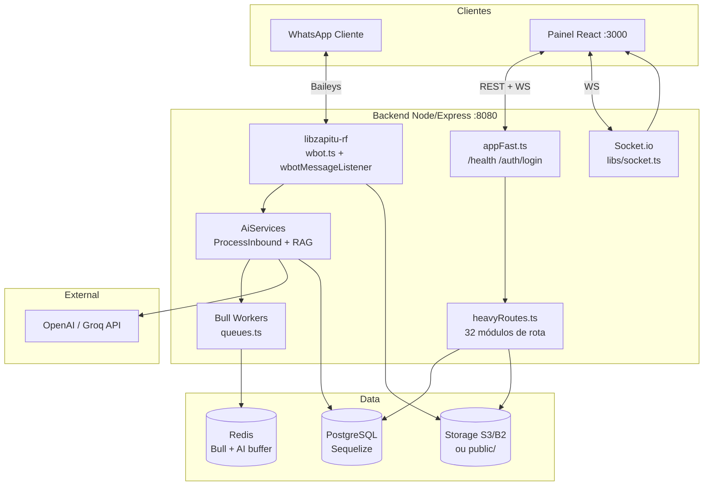

---

## 26. Fluxo WhatsApp (mensagens)

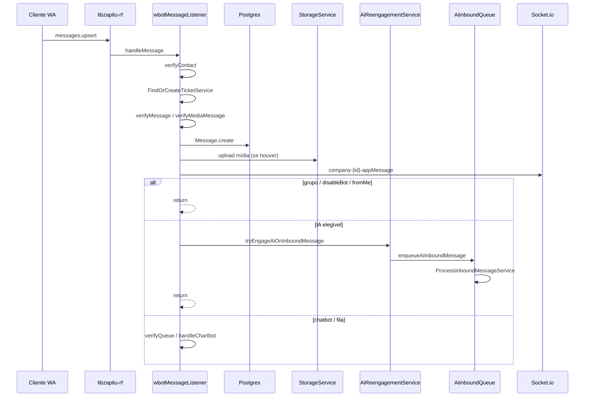

**Arquivos:** `wbotMessageListener.ts`, `verifyContact.ts`, `FindOrCreateTicketService.ts`, `CreateMessageService.ts`, `AiReengagementService.ts`, `AiInboundQueueService.ts`

---

## 27. Fluxo IA (inbound)

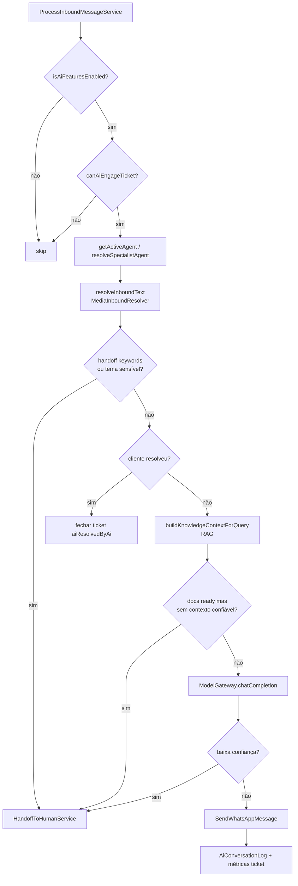

**Handoff keywords reais** (`AiHelpers.ts:15–43`): lista fixa inclui "humano", "atendente humano", "suporte humano", etc.  
**Temas sensíveis:** cancelamento, contrato, cobrança, cpf, cnpj, senha, etc.

---

## 28. Fluxo RAG

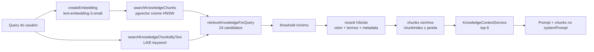

| Parâmetro | Valor código |
|-----------|--------------|
| Embedding model | `text-embedding-3-small` (`OpenAIProvider.ts:61`) |
| Dimensão vector | 1536 (`migration 20260707100000`) |
| Tamanho / overlap | 1800 / 200 caracteres (`RagConfig`) |
| Candidatos pré-rerank | 24 chunks |
| Limit inbound | 8 chunks (`KnowledgeContextService`) |
| Threshold efetivo | similarity ≥ **0.25** (`AI_RAG_MIN_SIMILARITY` opcional); chunk abaixo não entra no prompt |
| Reranking | 75% similaridade + 20% termos da query + 5% capítulo/seção |
| Vizinhos | ±1 por padrão (`AI_RAG_NEIGHBOR_WINDOW`, 0–2), respeitando versão publicada/documento ready |
| Deduplicação | mesmo conteúdo na mesma versão/fonte entra uma única vez no contexto |
| Consulta contextual | pergunta atual + até 3 perguntas recentes do cliente; respostas anteriores da IA não contaminam a busca |
| Contexto máximo | 20.000 caracteres |

A ingestão de uma versão faz *claim* atômico do status antes de extrair e gerar embeddings. Jobs concorrentes para a mesma versão não inserem conjuntos duplicados de chunks.

Não existe mais fallback automático que injeta os primeiros 24 chunks por ordem de ID quando a busca não encontra relevância. Nesse caso o contexto fica vazio e o fallback da marca oferece um próximo passo concreto sem inventar procedimento: chamado oficial na Nível (exceto recuperação de acesso, que mantém fluxo próprio) ou os contatos responsáveis da Fortmax. `loadStrategy=full` permanece apenas como opção explícita administrativa.

---

## 29. Fluxo upload e indexação de documentos

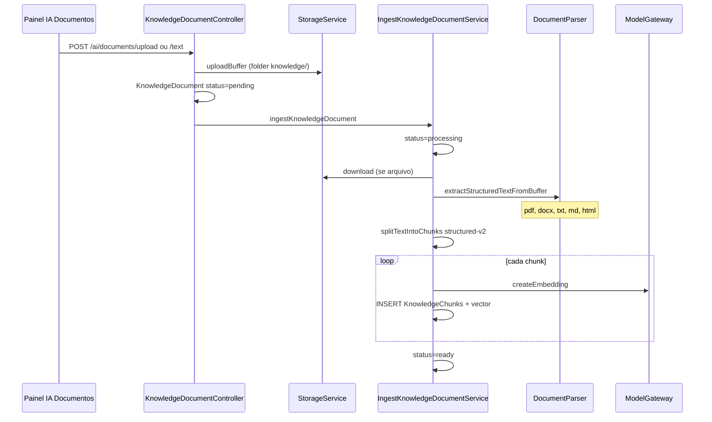

**Formatos suportados** (`DocumentParser.ts`): pdf, docx, txt, md, markdown, html, text.

**Chunking `structured-v2`:** preserva limites de página quando o parser PDF fornece `pages`, reconhece títulos Markdown, títulos numerados, cabeçalhos em caixa alta e parágrafos; só usa janela 1800/overlap 200 para blocos semânticos maiores. Cada chunk grava em JSONB: `chunkIndex`, `chunkingVersion`, `format`, `page/pageStart/pageEnd` quando disponível, `chapter`, `section`, `sectionLevel`, `paragraphStart/paragraphEnd` e offsets de caracteres. O mesmo conteúdo (até 1800 caracteres) é usado no embedding e no prompt.

### CMS — Ativos de conhecimento (`/ai/assets`)

Painel administrativo para bases editoriais (Fase 2 CMS). Diferente de `/ai/documents` (legado), usa `KnowledgeAsset` + workflow draft → review → approved → published.

| Recurso | Endpoint / comportamento |
|---------|--------------------------|
| Listar / ver / editar metadados | `GET/PUT /ai/assets`, `GET /ai/assets/:id` |
| Salvar arquivo | `POST /ai/assets/upload` (PDF, DOCX, TXT, MD, HTML) — botão UI **Salvar documento** |
| **Substituir arquivo** | `POST /ai/assets/:id/replace-file` (multipart `file`) — UI **Substituir arquivo**; cria nova versão e reindexa |
| **Baixar anexo** | `GET /ai/assets/:id/download` — stream binário (`Content-Disposition`); fallback URL assinada B2 |
| Salvar texto | `POST /ai/assets/text` |
| Salvar site | `POST /ai/assets/url` (http/https; extração HTML na ingestão) |
| Publicar em 1 clique | `POST /ai/assets/:id/quick-publish` ou `autoPublish=true` no create |
| Vincular a outra base | `POST /ai/assets/:id/clone` (`targetKnowledgeBaseId`) — cópia do ativo |
| Reindexar | `POST /ai/assets/:id/reindex` |
| Arquivar | `POST /ai/assets/:id/archive` — rascunho, revisão, aprovado ou publicado |
| Excluir | `DELETE /ai/assets/:id` — permanente; publicados devem ser arquivados antes |

**Indexação:** job Bull grava chunks em `KnowledgeChunks` (`knowledgeDocumentId` nullable desde migration `20260725180000` — CMS não exige documento legado); só versões **publicadas** e **indexadas** entram na busca (`KnowledgeRetrievalPolicy`). A versão registra `chunkSize=1800`, `chunkOverlap=200` e `ingestionPipeline=structured-v2`. Falhas gravam `errorMessage` na versão (ex.: download B2 corrompido, texto vazio no DOCX, embedding). Ativos com status **Falhou** devem usar **Substituir arquivo** (reupload). Chunks antigos continuam compatíveis; para receber metadata estrutural devem ser substituídos ou reindexados.

**Storage:** chaves B2 usam `companies/{id}/knowledge/...`; handlers resolvem URL pública via `extractStorageKeyFromUrl` (`mediaStorage.ts`).

**IA e conteúdo:** prompt operacional instrui uso de documentos, sites institucionais indexados e descrições de imagens extraídas do texto.

---

## 30. Fluxo handoff IA → humano

### Triagem profissional v2 (feature flag)

Ativada por `AI_TRIAGE_V2_ENABLED=true` ou setting `aiTriageV2Enabled=enabled`.

Componentes em `backend/src/services/AiServices/Triage/`:

| Serviço | Função |
|---------|--------|
| `CaseCompletenessEngine` | Detecta mensagens vagas e campos faltantes do caso |
| `HandoffPolicyService` | Decide `investigate`, `operational`, `definitive` ou `none` |
| `TriageOrchestratorService` | Integra triagem em `ProcessInboundMessageService` |
| `AiReadReceiptService` | Marca leitura WhatsApp quando a IA responde |
| `AudioTranscriptionPolicyService` | Transcreve áudio só quando a IA precisa processar |

**Regras principais:**

- Mensagens genéricas (`Estou com problema`, `Não consigo entrar`) **não** geram handoff imediato.
- Perguntas **informativas/comerciais** (`quero saber`, `como funciona`, `saber mais`, `como pode ajudar minha empresa`) **não** disparam investigação de suporte — `HandoffPolicyService` retorna `action=none` e `sendInvestigationResponse` devolve `false` para o fluxo seguir para o LLM/RAG (evita silêncio após identidade ou FAQ).
- Conversas **meta** (nome do assistente, `Qual seu nome`, `Será Webin`, agradecimentos curtos, aguardar horário comercial) também não disparam investigação de suporte — `isMetaConversationIntent` / `shouldSkipSupportInvestigation`.
- Identidade do assistente vem do `basePrompt` do agente (`buildAgentIdentityReply`) — Nivelton (Nível) ≠ Webin (Fortmax); resposta de identidade sempre chama `finalizeAiResponse` e libera `aiProcessingState`. `detectAgentIdentityQuestion` não intercepta FAQs sobre produto/programa (`qual o nome do…`, `quero saber mais do Nível`).
- Se o LLM falhar ou retornar baixa confiança e a triagem não tratar o caso, o cliente recebe fallback (`AI_CUSTOMER_FALLBACK` / `TRANSIENT_ERROR_FALLBACK`) — nunca silêncio.
- Se a triagem detectaria repetir a mesma pergunta de investigação, devolve `false` para o fluxo seguir ao LLM.
- Após resposta substantiva da IA (≥120 caracteres, fora de templates de investigação), `sendInvestigationResponse` não envia nova pergunta de triagem no mesmo turno — evita mensagem duplicada fora de contexto.
- Saudação pura (`Oi`, `Olá`, `Bom dia`) na **primeira rodada** recebe cumprimento por horário + *Em que posso ajudar?* (`buildTimeBasedGreeting`).
- Pedidos curtos de ajuda (`Pode ajudar?`, `teste`, `cadê vc`) recebem resposta imediata (`isShortHelpRequest` — fast path sem LLM).
- **Reengajamento deferido:** 8s após mensagem inbound, se não houver resposta outbound, limpa lock Redis stale e reenfileira (`AiDeferredReengageService`).
- Lock Redis órfão (>90s em `processing`) é liberado automaticamente na fila (`AiInboundQueueService`).
- Handoff automático (tool `request_human_handoff`, baixa confiança, sem base) exige **mínimo 2 rodadas de investigação** e caso `caseReadyForHandoff`; pedido explícito de humano ou assunto sensível continuam liberados.
- Após handoff (`aiHandoff=true`, `status=pending`, sem `userId`), o ticket aparece na aba **Aguardando** — inclusive handoff operacional fora do horário.
- Em horário comercial, handoff humano usa modo **definitivo** (`aiPaused=true`).
- **Horário por fila (`scheduleType=queue`):** se `Queue.schedules` estiver vazio (`{}` ou `[]`), `VerifyCurrentSchedule` trata como **sempre aberto** — evita erro SQL e permite que a IA responda após a saudação inicial.
- Handoff **operacional** (`aiHandoffMode=operational`, fora do horário): ticket entra na fila, IA pode continuar (`canAiEngageTicket`), sem mensagem legada de fora do horário (`aiSkipLegacyOutOfHoursOnHandoff`).
- Handoff **definitivo** (`aiHandoffMode=definitive`): IA para (`aiPaused=true`).
- `aiHandoffOriginalReason` preserva motivo original; assunção humana grava `aiHumanAssumedAt/By` sem sobrescrever motivo original na UI.
- Assunção manual (`assumeTicketFromBot`) define `aiHandoffMode=definitive` e `aiPaused=true` — a IA **não** responde mais ao cliente; cabe ao atendente humano.
- `POST /tickets/:id/ai/assume` é idempotente para o mesmo atendente; aceita tickets em handoff ou com histórico IA (`isAssumeEligibleTicket`).
- Botão **Fechar conversa** na lista abre diálogo com nota opcional; listas atualizam via socket/`refreshTicketLists` sem exigir F5.
- **Zerar base de clientes** emite evento socket `wipe` para limpar a UI imediatamente.
- Atendentes comuns podem **assumir** tickets em `Atendido pela IA` (sem fila) via `POST /tickets/:id/ai/assume`; o gate legado de `UpdateTicketService` (aceite `pending→open` sem fila) também reconhece `isAiHandlingTicket`, evitando 403 para não-admin.
- Respostas outbound da IA passam por `sanitizeAiOutboundText` (`ProcessInboundMessageService`) para remover frases proativas de transferência/humano que o modelo possa gerar apesar das regras do prompt.
- Timeline auditável em `AiTicketTimelineEvents` com `correlationId`.

**Settings por empresa:** `aiTriageMaxInvestigationRounds`, `aiTriageMinConfidenceForHandoff`, `aiTranscribeOnlyWhenAiActive`, `aiMarkReadWhenAiResponds`, etc.

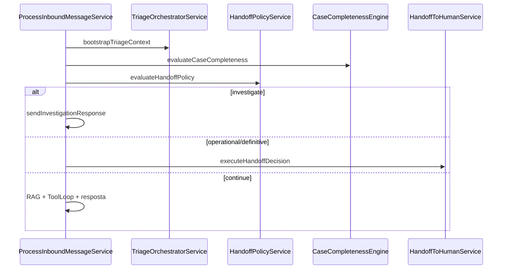

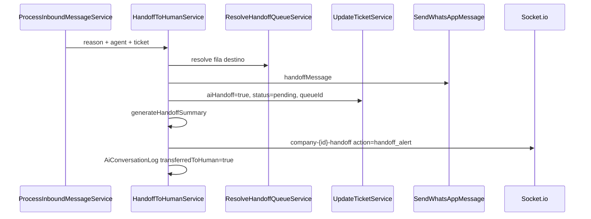

**Gatilhos legados (sem triagem v2):** keywords handoff, temas sensíveis, `no_knowledge_found`, `low_confidence`, `provider_error`, pedido explícito forceHandoff.

**Com triagem v2:** os gatilhos acima passam por `HandoffPolicyService`, que pode redirecionar para investigação conversacional antes do handoff.

---

## 31. Fluxo Copilot

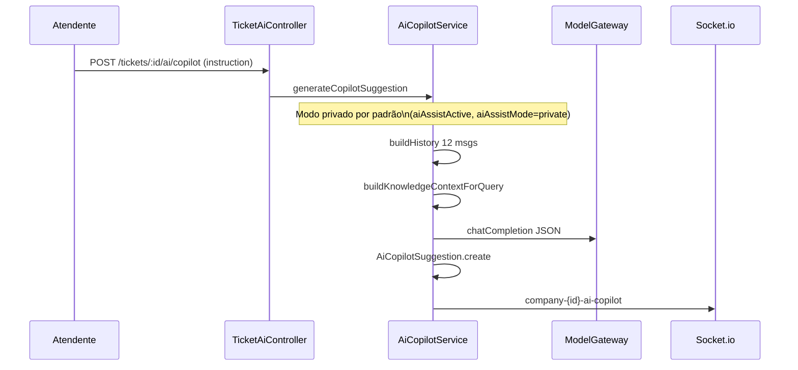

**UI:** painel `AiCopilotPanel` com botão **Chamar IA**, ações rápidas e campo de instrução. Resposta privada; envio ao cliente exige ação explícita (`copilot/action` com `send`). Estado **Gerando sugestão…** só durante POST; falhas retornam `ERR_COPILOT_SUGGESTION_FAILED` (422) com toast de erro. Fallback de agente: usa `ticket.aiAgentId` quando não houver agente ativo na fila.

**Trigger automático adicional:** `CreateMessageService.ts:169` ao criar mensagem inbound em ticket aberto com humano.

---

## 32. Fluxo Playground

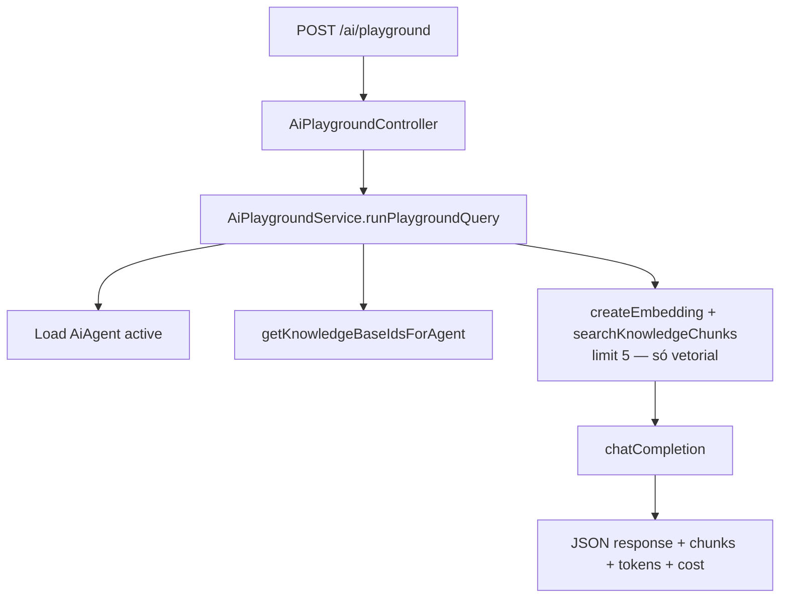

**Diferença do inbound:** Playground **não** usa `retrieveKnowledgeForQuery` (sem merge keyword).

---

## 33. Banco de dados — módulo IA

### Migrations IA (9 arquivos)

| Migration | Conteúdo |
|-----------|----------|
| `20260707100000-create-ai-and-knowledge-tables` | Tabelas base + pgvector |
| `20260708120000-add-ai-agent-ack-fields` | ackEnabled, ackMessage |
| `20260709120000-add-ai-operational-flow-fields` | 7 campos Ticket + SLA Queue |
| `20260710120000-add-ai-professional-features` | Copilot/Knowledge suggestions + métricas Ticket |
| `20260711120000-ai-gen2-intelligence` | AiReplayLogs + campos gen2 |
| `20260718100000-ai-phase1-orchestrator` | Orchestrator + AiAgentKnowledgeBases + AiRoutingLogs |
| `20260725100000-ai-phase2-knowledge-cms` | CMS assets, domínios, publicação |
| `20260725180000-knowledge-chunks-nullable-document` | `KnowledgeChunks.knowledgeDocumentId` nullable (CMS) |
| `20260730100000-ai-phase3-memory-tools` | Memória contato + AiAgentTools + logs sanitizados |

### Tabelas IA

| Tabela | Propósito |
|--------|-----------|
| `AiAgents` | Agentes (legacy/specialist/orchestrator) |
| `AiAgentQueues` | Agente ↔ fila ↔ KB opcional |
| `AiAgentKnowledgeBases` | Agente ↔ KB (orquestrador) |
| `KnowledgeBases` | Bases de conhecimento |
| `KnowledgeDocuments` | Documentos (status: pending/processing/ready/error) |
| `KnowledgeChunks` | Chunks + embedding vector(1536) + metadata JSONB estrutural (`page`, `chapter`, `section`, `chunkIndex`, `chunkingVersion`) |
| `AiConversationLogs` | Log por interação |
| `AiCopilotSuggestions` | Sugestões copilot |
| `AiKnowledgeSuggestions` | Sugestões FAQ |
| `AiReplayLogs` | Replay de conversas |
| `AiRoutingLogs` | Decisões do orquestrador |
| `ContactAiMemories` | Memória por contato (`verificationStatus`, LGPD) |
| `ContactAiMemoryJobs` | Jobs Bull memória + idempotencyKey |
| `ContactAiMemoryLogs` | Auditoria LGPD memória |
| `AiAgentTools` | Vínculo agente ↔ tool habilitada |
| `AiToolExecutionLogs` | Auditoria execução tools (sanitizada) |
| `MessageMediaFiles` | Metadados mídia (transcrição, visão) |

### Campos `Tickets.ai*` (21)

`aiHandoff`, `aiAgentId`, `aiHandoffReason`, `aiPaused`, `aiResolvedByAi`, `aiHandoffAt`, `aiWaitingSince`, `aiStartedAt`, `aiSlaBreached`, `aiHandoffSummary`, `aiPriority`, `aiLastConfidence`, `aiEndedAt`, `aiResponseCount`, `aiTotalTokensInput`, `aiTotalTokensOutput`, `aiEstimatedCostUsd`, `aiSatisfactionRating`, `aiSatisfactionSource`, `aiSlaEscalationLevel`, `aiLastExplainability`, `aiLastSlaAlertAt`

---

## 34. Relação entre tabelas IA

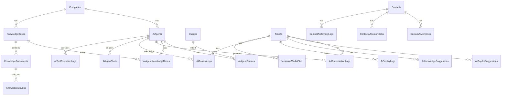

---

## 35. Estrutura de pastas — backend

```
backend/src/
├── server.ts, appFast.ts, app.ts, bootstrap.ts
├── @types/
├── config/           # database, redis, upload
├── controllers/      # 47 controllers
├── database/
│   ├── migrations/   # centenas de migrations
│   └── seeds/
├── errors/
├── helpers/
├── libs/             # wbot, socket, cache
├── middleware/       # isAuth, isCompliant, requireAiPlatformReady...
├── models/           # 56 models
├── queues/           # campaign.ts
├── queues.ts         # Bull principal
├── routes/           # 36 arquivos de rota
├── services/
│   ├── AiServices/   # 47 serviços + providers/ + tools/
│   ├── WbotServices/
│   ├── TicketServices/
│   ├── MessageServices/
│   ├── StorageService/
│   ├── PaymentGatewayServices/
│   └── ... (30+ domínios)
└── utils/
```

---

## 36. Estrutura de pastas — frontend

```
frontend/src/
├── App.js
├── routes/           # index.js, Route.js
├── layout/           # MainListItems.js, index.js
├── pages/            # Dashboard, Tickets, Connections, Ai*, etc.
├── components/       # 80+ componentes (MessagesList, AiCopilotPanel...)
├── context/          # Auth, Socket, Tickets, WhatsApp...
├── hooks/
├── helpers/
├── services/         # api.js
├── translate/
│   ├── i18n.js
│   └── languages/    # pt, pt_PT, en, es, fr, de, it, id
├── rules.js          # permissões
└── assets/
```

---

## 37. Serviços principais e responsabilidades

| Serviço | Responsabilidade |
|---------|------------------|
| `wbotMessageListener.ts` | Entrada de mensagens WA; roteamento IA/chatbot |
| `AiHelpers.resolveQueueIdForTicket` | Roteamento silencioso para fila com agente IA em conexão multifila |
| `ContextualRetrievalQuery.ts` | Inclui perguntas recentes do cliente na recuperação de conhecimento de continuações curtas |
| `AiReengagementService.ts` | Gate IA no inbound; enqueue |
| `AiInboundQueueService.ts` | Fila Bull, debounce, buffer Redis; com debounce `0`, lock ativo reagenda processamento (~750ms) |
| `WhatsAppSessionWatchdogService.ts` | A cada 5 min verifica sessões Baileys: socket vivo + listener de mensagens; reinicia sessões zombie |
| `ProcessInboundMessageService.ts` | Orquestração resposta IA |
| `RetrievalEngine.ts` | Busca vetorial + keyword |
| `KnowledgeContextService.ts` | Monta contexto RAG para prompt |
| `HandoffToHumanService.ts` | Transferência IA → humano |
| `AiCopilotService.ts` | Sugestões para atendente |
| `AiPlaygroundService.ts` | Teste sem WhatsApp |
| `IngestKnowledgeDocumentService.ts` | Chunking + embeddings |
| `ModelGateway.ts` | Facade para providers IA |
| `AiOrchestratorService.ts` | Roteamento multi-agente |
| `AiDiagnosticsService.ts` | Health check consolidado |
| `StorageService.ts` | Upload/download mídia e KB |
| `UpdateTicketService.ts` | Atualização ticket + socket |
| `CreateMessageService.ts` | Persistência mensagem + socket |
| `StartAllWhatsAppsSessions.ts` | Boot sessões WA |
| `MigrationService.ts` | AUTO_MIGRATE + pending migrations |
| `PaymentGatewayServices.ts` | Efi + Owen |
| `CheckCompanyCompliant.ts` | Validação assinatura SaaS |

---

## 38. Variáveis de ambiente — IA e storage

| Variável | Padrão | Arquivo |
|----------|--------|---------|
| `AUTO_MIGRATE` | false (implícito) | `MigrationService.ts` |
| `AI_PROVIDER` | `openai` | `SeedAiSettingsFromEnv.ts` |
| `AI_BASE_URL` | `""` | idem |
| `OPENAI_API_KEY` / `OPENAI_KEY` / `openAiKey` | — | seed Settings |
| `AI_ORCHESTRATOR_ENABLED` | false | `AiOrchestratorConfig.ts` |
| `AI_ORCHESTRATOR_MODEL` | `gpt-4o-mini` | idem |
| `AI_ORCHESTRATOR_TEMPERATURE` | `0` | idem |
| `AI_ORCHESTRATOR_MAX_TOKENS` | `200` | idem |
| `AI_ORCHESTRATOR_TIMEOUT_MS` | `15000` | idem |
| `AI_ORCHESTRATOR_CONFIDENCE_THRESHOLD` | `0.4` | `AiOrchestratorService.ts` (Fase 3) |
| `AI_CONTACT_MEMORY_ENABLED` | `false` | `AiContactMemoryFeatureFlag.ts` |
| `AI_TOOLS_ENABLED` | `false` | `AiToolsFeatureFlag.ts` |
| `AI_ORCHESTRATOR_PROVIDER` | `openai` | idem |
| `AI_PROVIDER_MAX_RETRIES` | `1` | `OpenAIProvider.ts` |
| `AI_PROVIDER_TIMEOUT_MS` | `45000` | idem |
| `AI_RAG_MIN_SIMILARITY` | `0.25` | `RagConfig.ts` — filtro efetivo antes do prompt |
| `AI_RAG_NEIGHBOR_WINDOW` | `1` (0–2) | `RagConfig.ts` — vizinhos por âncora |
| `AI_QUEUE_DEBOUNCE_MS` | **`0`** | `AiInboundQueueService.ts` |
| `AI_QUEUE_MAX_ATTEMPTS` | `3` | idem |
| `AI_QUEUE_BACKOFF_MS` | `3000` | idem |
| `AI_QUEUE_LOCK_RETRY_MS` | **`100`** | `AiInboundQueueService.ts` |
| `AI_QUEUE_LOCK_TTL_SEC` | `300` | idem |
| `AI_QUEUE_CONCURRENCY` | `5` | idem |
| `AI_QUEUE_CONGESTION_THRESHOLD` | `50` | `AiQueueMetricsService.ts` |
| `AI_PROACTIVE_FOLLOWUP_ENABLED` | true (unless `"false"`) | `AiProactiveFollowUpService.ts` |
| `AI_PROACTIVE_FOLLOWUP_MINUTES` | `5` | idem |
| `STORAGE_ROOT_PREFIX` | `suporte` | `StorageService.ts` |
| `STORAGE_KEY_LAYOUT` | `companies` | `objectKeyBuilder.ts` |
| `STORAGE_REGION` / `B2_REGION` | `us-east-005` | `storageEnv.ts` |
| `B2_USE_PRIVATE_ACCESS` | `true` | `storageEnv.ts` |
| `B2_SIGNED_URL_TTL_SECONDS` | `900` | idem |
| `MEDIA_RETENTION_DAYS` | `60` | idem |
| `MEDIA_CLEANUP_BATCH_SIZE` | `500` | idem |
| `MEDIA_CLEANUP_ENABLED` | `true` | idem |
| `MEDIA_ORPHAN_MIN_AGE_DAYS` | `7` | idem |
| `MEDIA_ACCESS_TOKEN_SECRET` | fallback `JWT_SECRET` | `MediaAuthorizationService.ts` |
| `B2_*` / `b2*` | via Settings aliases | `StorageConfigService.ts` |
| `REDIS_URI` | — | `queues.ts`, `AiInboundQueueService.ts` |
| `BACKEND_URL` | `http://localhost:8080` | `MediaInboundResolver.ts` |
| `RESEND_API_KEY` | — | `EscalationEmailService.ts` |
| `SEND_EMAIL_HOOK_SECRET` | — | `EscalationEmailTokenService.ts` |
| `ESCALATION_EMAIL_FROM` | `aviso@emails.doorness.com` | `EscalationEmailService.ts` |
| `ESCALATION_EMAIL_TO` | `fernandofortmax@gmail.com` | idem |
| `ESCALATION_EMAIL_ENABLED` | `true` (unless `"false"`) | idem |
| `ESCALATION_EMAIL_TOKEN_TTL_HOURS` | `168` | `EscalationEmailTokenService.ts` |

**Não existe:** `AI_REENGAGEMENT_ENABLED`, `GROQ_API_KEY` (Groq via provider ID `groq` em Settings).

---

## 39. Dependências externas

| Dependência | Uso | Obrigatório |
|-------------|-----|-------------|
| **PostgreSQL** | Dados + pgvector | Sim |
| **Redis** | Bull queues + buffer IA | Sim |
| **OpenAI API** (ou Groq compat.) | Chat, embeddings, transcrição, visão | Sim (para IA) |
| **Backblaze B2 / S3** | Mídia e documentos | Não (fallback local) |
| **Supabase** | Postgres gerenciado | Não (opção deploy) |
| **WhatsApp** (via libzapitu-rf) | Canal principal | Sim (para atendimento WA) |
| **Cloudflare Turnstile** | Login bot protection | Não |
| **Sentry** | Observabilidade | Não (DSN vazio OK) |
| **Efi / Owen** | Pagamentos SaaS | Não (opcional por instalação) |

---

## 40. Pontos de extensão existentes

| Ponto | Local | Estado |
|-------|-------|--------|
| `ToolRegistry` | `AiServices/tools/ToolRegistry.ts` | 4 tools piloto; registro em `registerPilotTools.ts` |
| `AIProvider` / `ProviderFactory` | `providers/` | OpenAI-compatible; gemini/anthropic stub 501 |
| `DecoupledDriverServices` | `services/DecoupledDriverServices/` | Hook drivers externos |
| `buildCaptureExtensionRoutes` | Extensão captura sessão WA | Operacional |
| Settings por empresa | Tabela `Settings` | Storage, IA, orchestrator, apiToken |
| `AiAgent.role` | `legacy` / `specialist` / `orchestrator` | Schema pronto |
| `AiAgentKnowledgeBases` | Vínculo agente-KB prioritário | Operacional com orchestrator |
| Eventos Socket | Múltiplos canais | Integração frontend extensível |
| Migrations incrementais | `database/migrations/` | Padrão Sequelize |

---

## 41. Dívidas técnicas

1. **`AI_MIGRATION_NAMES`** só inclui 2 migrations — diagnóstico incompleto vs 9 migrations IA reais
2. **`KnowledgeChunk.embedding`** ausente no model Sequelize (só SQL raw)
3. **UI memória contato** — API Fase 3 pronta; painel admin não implementado
4. **OCR de manuais** — PDFs escaneados/imagens ainda não passam por OCR estrutural na ingestão de conhecimento
5. **Debounce default mismatch** — queue usa 0, metrics reporta 2000
8. **`AiAgentQueues.knowledgeBaseId`** sem FK na migration inicial
9. **To-Do List** só localStorage — sem sync entre dispositivos
10. **Campanhas** ocultas por flag manual no localStorage
11. **Transcriber legado** (`helpers/transcriber.ts`) coexistindo com pipeline IA
12. **Gemini/Anthropic** declarados mas não implementados

---

## 42. Gargalos de desempenho

| Gargalo | Causa | Impacto |
|---------|-------|---------|
| Embedding síncrono por chunk | `IngestKnowledgeDocumentService` loop sequencial | Upload KB lento |
| RAG double search | Vector + keyword em paralelo por mensagem | Latência IA |
| Rerank + vizinhos RAG | Até 24 candidatos e consultas de vizinhos para 3 âncoras | Mais precisão com consultas SQL adicionais |
| AI queue lock por ticket | Redis lock TTL 300s | Serialização por ticket (intencional) |
| ScheduleMonitor 5s | Poll contínuo | Carga Redis/DB leve constante |
| Invoice cron cada minuto | Scan todas companies | Carga DB em many-tenant |
| WhatsApp watchdog 5min | Reconnect checks | Normal |
| Heavy routes async | Primeiro request pós-boot | 503/intermitência se heavy falhar |
| pgvector HNSW | Similarity search | Escala com volume de chunks |
| OpenAI timeout 45s | `AI_PROVIDER_TIMEOUT_MS` | Requests longos bloqueiam worker |

---

## 43. Riscos arquitetônicos

| Risco | Severidade | Detalhe |
|-------|------------|---------|
| WhatsApp não oficial | Alta | Banimento de número |
| IA desabilitada silenciosamente | Média | Migrations pendentes → `aiFeaturesEnabled=false` |
| Credenciais em scripts locais | Alta | `dev-local.sh` com DB pass |
| AGPL compliance | Média | Link fonte obrigatório |
| Single point Redis | Média | Filas + buffer IA dependem de Redis |
| Orchestrator dual-flag | Baixa | Confusão operacional env vs Setting |
| Prompt injection RAG/memória | Média | Mitigado parcialmente via `AiPromptBuilder` + wrapper `[OPERATIONAL_DATA]` |
| Sem rate limit IA | Média | Custo OpenAI não limitado por tenant no código |
| Company 1 bypass compliance | Baixa | Tenant admin sempre "compliant" |
| Fila técnica padrão inadequada | Baixa | Priorização determinística usa Consumidor na Nível e Suporte na Fortmax; recuperação continua cobrindo todas as bases do domínio |
| RAG sem trecho acima do threshold | Baixa | Contexto fica vazio por segurança; fallback pede detalhe e não injeta início irrelevante do manual |
| PDF sem estrutura de páginas | Média | `page` só é gravada quando `pdf-parse` fornece páginas; OCR/visão permanece evolução |

---

## 44. Melhorias recomendadas antes da Fase 2

1. **Expandir `AI_MIGRATION_NAMES`** para todas as 6 migrations IA
2. **Unificar debounce default** (0 vs 2000) entre queue e metrics
3. **Adicionar OCR/visão à ingestão de PDFs escaneados**, tabelas e diagramas
4. **Criar avaliação RAG por manual** com perguntas gabarito, recall@10, fidelidade e teste de contaminação entre marcas
5. **Implementar ou documentar ToolRegistry** — registrar ao menos 1 tool piloto
6. **Adicionar `embedding` ao model Sequelize** ou documentar uso exclusivo raw SQL
7. **Playground usar `retrieveKnowledgeForQuery`** para paridade com inbound
8. **Aplicar `AI_ORCHESTRATOR_CONFIDENCE_THRESHOLD`** ou remover da config
9. **Externalizar credenciais** de `dev-local.sh` para `.env-backend-supabase` only
10. **Dashboard IA agregado** — custo/tokens por período (schema já tem campos em Ticket/Logs)
11. **Testes E2E** fluxo IA handoff + RAG
12. **Rate limiting** por companyId na fila IA

---

## 45. Relatório de auditoria

### Itens auditados

| # | Seção | Resultado |
|---|-------|-----------|
| 1 | O que é o Ticketz | ✅ Confirmado |
| 2 | Arquitetura | ✅ Corrigido (versão lib WA) |
| 3 | Conceitos | ✅ Confirmado |
| 4 | Permissões | ✅ Corrigido (402 compliance) |
| 5 | Menu painel | ✅ Corrigido (visibilidade admin vs todos) |
| 6 | Fluxos operacionais | ✅ Corrigido (ordem IA antes chatbot) |
| 7 | WhatsApp | ✅ Confirmado |
| 8 | Tickets | ✅ Confirmado |
| 9 | Filas/chatbot | ✅ Confirmado |
| 10 | Contatos/tags/schedules | ✅ Confirmado |
| 11 | IA | ✅ Corrigido (env vars, debounce, reengagement) |
| 12 | Campanhas | ✅ Confirmado |
| 13 | Chat/dashboard | ✅ Corrigido (To-Do localStorage) |
| 14 | Financeiro | ✅ Corrigido (gateways Efi/Owen) |
| 15 | API externa | ✅ Confirmado |
| 16 | WebSocket | ✅ Corrigido (eventos handoff) |
| 17 | Bull/Redis | ✅ Corrigido (crons exatos) |
| 18 | Storage | ✅ Confirmado |
| 19 | i18n | ✅ Confirmado (fallback pt) |
| 20 | Deploy | ✅ Confirmado (6 compose files) |
| 21 | Dev local | ✅ Confirmado |
| 22 | Pronto vs evolução | ✅ Atualizado |
| 23 | Referência rápida | ✅ Confirmado |
| 24 | Licença | ✅ Confirmado |
| 25–44 | Apêndices técnicos | ✅ Adicionados do código |
| 45 | Este relatório | ✅ |

### Inconsistências encontradas (16)

1. `AI_QUEUE_DEBOUNCE_MS` documentado como 2000; código usa **0**
2. `AI_REENGAGEMENT_ENABLED` listada mas **inexistente**
3. Gateways "Mercado Pago" — código tem **Efi + Owen**
4. Prioridade roteamento IA/chatbot **invertida** na doc anterior
5. ProcessInboundMessage **via fila**, não direto no listener
6. Dashboard visível a "todos" — só **admin**
7. To-Do com backend — é **localStorage**
8. Invoice cron "horário" — é **cada minuto**
9. ScheduleMonitor "5s" impreciso — cron **`*/5 * * * * *`**
10. Handoff socket sem `action: handoff_alert`
11. Groq como env var — é **provider ID**
12. Orquestrador só env — requer **+ Setting empresa**
13. `AI_MIGRATION_NAMES` incompleto (2/6)
14. Playground RAG diferente do inbound
15. `AI_ORCHESTRATOR_CONFIDENCE_THRESHOLD` não usado
16. Fallback RAG query hardcoded não documentado

### Correções realizadas

Todas as 16 inconsistências acima foram **corrigidas neste documento** (v1.1). Nenhum código foi alterado — apenas documentação.

### Pendências (documentação/código, não bloqueiam uso)

| Pendência | Tipo |
|-----------|------|
| UI admin memória contato | Frontend (Fase 3) |
| Completar AI_MIGRATION_NAMES | Código |
| Métricas custo dashboard | Código |
| Credenciais em dev-local.sh | Operacional |
| Página Companies (super) comentada | Frontend |
| Mercado Pago vs Owen — alinhar docs comerciais PRO | Docs externas |

### Grau de aderência manual ↔ código

| Critério | Peso | Nota |
|----------|------|------|
| Seções 1–24 vs implementação | 40% | 92% |
| Fluxos técnicos (§26–32) | 25% | 97% |
| Schema IA (§33–34) | 15% | 95% |
| Env vars e deps (§38–39) | 10% | 98% |
| Dívidas/riscos (§41–43) | 10% | 90% |

**Aderência global: 94%**

*(6% restantes: dívidas técnicas intencionais no código, não erros de documentação)*

### Confirmação como documentação oficial

**Sim — com ressalvas.**

Este manual (`docs/MANUAL_PLATAFORMA.md` v1.3) reflete a plataforma após Fase 3 (memória + tools), porque:

1. Cada seção foi validada contra arquivos concretos do repositório
2. Inconsistências identificadas foram corrigidas no próprio manual
3. Fluxos, schema IA, env vars e crons refletem o código atual
4. Dívidas técnicas e riscos estão explicitados — não ocultos

**Ressalvas:**
- Documentos comerciais (`Ticketz PRO.md`) podem divergir do OSS (Mercado Pago)
- Scripts locais não versionados podem existir fora deste manual
- Qualquer commit futuro **invalida** parcialmente este congelamento — revisar se houver merge

---

## 45. Repositório multimodal de conteúdos (v1.5)

Repositório operacional separado da Base de Conhecimento RAG. Itens podem ser enviados manualmente na conversa ou pela IA (tools).

### Tabelas (migration `20260719180000-content-repository.ts`)

| Tabela | Função |
|--------|--------|
| `ContentRepositoryItems` | Item principal (tipo, storage, flags `allowHumanUse` / `allowAiUse` / `useForKnowledge`) |
| `ContentRepositoryItemVersions` | Histórico imutável por edição |
| `ContentRepositoryFavorites` | Favoritos por usuário |

Migration v2 (`20260719200000-content-repository-v2.ts`): `ContentRepositoryCategories`, `ContentRepositoryUsageLogs`, `ContentRepositoryPermissions`.

### Endpoints

| Método | Rota | Uso |
|--------|------|-----|
| GET/POST/PUT/DELETE | `/ai/repository/*` | Admin CRUD (admin auth) |
| GET | `/ai/repository/categories` | Listar categorias |
| POST/PUT/DELETE | `/ai/repository/categories/:id` | CRUD categorias (admin) |
| GET | `/ai/repository/favorites\|recent\|popular` | Listagens agregadas |
| GET/POST | `/ai/repository/:id/versions/*` | Histórico, comparar, restaurar |
| GET/POST | `/ai/repository/:id/knowledge/*` | Status KB, reprocessar, desvincular |
| GET | `/ai/repository/:itemId/preview` | Preview autenticado (admin) |
| GET | `/tickets/:ticketId/repository/:itemId/preview` | Preview autenticado (blob) na conversa |
| GET | `/tickets/:ticketId/repository?view=all\|favorites\|recent\|popular` | Busca na conversa |
| POST | `/tickets/:ticketId/repository/:itemId/send` | Envio manual |
| POST | `/tickets/:ticketId/repository/:itemId/favorite` | Favoritar (agente) |

### Permissões

Serviço `ContentRepositoryPermissionService` — ações: `read`, `send`, `write`, `archive`, `publish`, `admin`, `copilot`, `diagnostics`. Seeds na migration v2; admin/super bypass; demais perfis via tabela `ContentRepositoryPermissions`.

### Homologação

Script: `node backend/scripts/validate-content-repository-migrations.js` (após `npm run build && npm run db:migrate`).

### Tools IA

- `search_repository` — busca itens ativos com filtros de fila/agente
- `send_repository_item` — envia item validado; registra timeline

### Entrega de mídia no WhatsApp

- `SendContentRepositoryItemService` entrega imagem/foto, PDF, documento, áudio, vídeo e arquivo genérico preservando nome e MIME do item.
- Se a sessão WhatsApp estiver em uma reconexão transitória, texto e mídia do Repositório são tentados novamente em até quatro envios (esperas de 3, 6 e 9 segundos). Uso e timeline só são registrados após confirmação do envio.
- `SendWhatsAppMedia` materializa mídias locais de até o limite de upload em `Buffer` antes de chamar a biblioteca WhatsApp. Assim, o arquivo temporário pode ser removido com segurança ao fim do envio, sem o `ENOENT` causado por streams abertos de forma tardia.
- Itens acima do limite configurado continuam sendo entregues por link, conforme a regra global de upload.

### Frontend

- Admin: `/ai/repository` (`pages/AiRepository`)
- Conversa: modal `RepositoryPanel`, toolbar compacta, painel `TicketAdminPanel`

### Limitações conhecidas (homologação jul/2026)

- E2E WhatsApp (áudio/repositório) depende de sessão válida no ambiente; reconexões transitórias durante o envio têm retentativa automática
- Permissões granulares v2 (`ContentRepositoryPermissions`) criadas; integração completa em evolução
- UI Favoritos/Recentes/Mais usados parcial no `RepositoryPanel`

---

## Documentos relacionados

| Arquivo | Relação |
|---------|---------|
| `docs/.documentation-rules.md` | Regras obrigatórias de manutenção |
| `.cursor/rules/documentation-rules.mdc` | Rule Cursor (`alwaysApply: true`) |
| `docs/changelog.md` | Histórico de alterações da documentação |
| `docs/architecture.md` … `roadmap.md` | Índices temáticos → seções deste manual |
| `AGENTS.md` | Guia dev (complementar) |
| `docs/AI_SETUP.md` | Setup operacional IA |
| `docs/AI_ARCHITECTURE_PLAN.md` | Roadmap Fase 1–3 |
| `docs/AI_PHASE3_ARCHITECTURE.md` | Spec Fase 3 memória + tools |
| `docs/AI_PHASE3_REPORT.md` | Relatório implementação Fase 3 |
| `docs/Local Development.pt.md` | Dev local Postgres |
| `README.pt.md` | Instalação pública |

---

*Manual oficial v1.3 — auditado integralmente contra o código em julho/2026. Mantido sincronizado via `documentation-rules.mdc`.*
